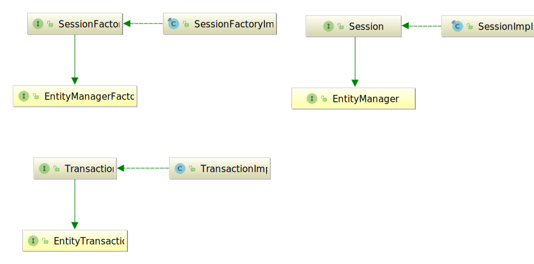

## Architecture

### Overview

​	

Java 애플리케이션은 Hibernate API를 사용하여 도메인 데이터를 로드, 저장, 쿼리 등의 작업을 한다

Hibernate는 Java Persistence API 명세를 구현하고 JPA 인터페이스와 Hibernate 특정 구현 간의 관계는 다음과 같다

### SessionFactory(`org.hibernate.SessionFactory`)

애플리케이션의 도메인 모델을 데이터베이스에 매핑을 thread-safe하게 표현한 것이다. `org.hibernate.Session` 인스턴스의 factory열할을한다. `EntityManagerFactory`는 기본적으로 JPA의 `SessionFactory`와 동일하며 이 두가지는 동일한 `SessionFactory` 구현으로 된다.

`SessionFactory`는 생성 비용이 많이 들기때문에, 주어진 데이터베이스에서 애플리케이션은 하나의 관련된 `SessionFactory`를 사용한다. `SessionFactory`는 2차 캐시, 컨넥션 풀, 트랜잭션 시스템 인티그레이션 등 Hibernate가 사용하는 모든 `Session` 서비스를 유지한다.

### Session(`org.hibernate.Session`)

JPA에서는 `Session`은 `EntityManager`로 표현된다.

`Session`은 JDBC `java.sql.Connection`을 랩핑하고 `org.hibernate.Transaction` 인스턴스에 대한 factory역할을 한다. `Session`은 애플리케이션 도메인 모델의 일반적으로 반복적으로 읽을 수 있는 영속성 컨텍스트(first level cache)를 유지한다.

### Transaction(`org.hibernate.Transaction`)

개별 물리적 트랜잭션 경계를 구분하기 위해 응용 프로그램에서 사용하는 단일 스레드의 단기 객체이다. JPA에서는 `EntityTransaction`으로 표현되며 트랜젝션 시스템으로 부터 애플리케이션을 분리하는 추상 API 역할을 한다.
