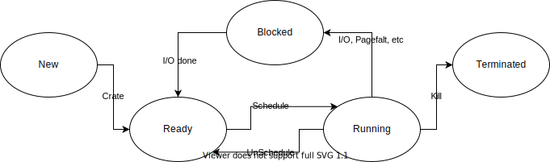

## Processes

### Process Model

프로세스는 실행중인 프로그램의 인스턴스로 프로그램 카운터, 레지스터, 변수 등의 값을 포함한다.

### Process Creation

#### 프로세스를 생성하는 2가지 방법

1. 시스템 시작
2. 동작중인 프로세스에서 프로세스 생성 system call 실행

프로세스가 새로 만들어 질때 child 프로세스와 parent 프로세스는 공유되는 메모리가 없다

### Process Termination

- 정상적인 종료
- 치명적인 오류 발생
- 프로세스 오류로 종료
- 다른 프로그램에 의한 종료  -> signal 이 발생한다

### Process Hierarchies

시스템에 존재하는 모든 프로세스는 `init` 을 루트로하는 트리구조이다.

### Process States

### Implementation of Processes

프로세스마다 프로세스 테이블을 가지고 있으며 프로세스 테이블에는 모든 프로세스 상태를 포함하며, program counter, stack pointer, memory 할당 정보, 해당 프로세스가 연 파일 정보, 스케쥴 정보 등 프로세스가 `running`에서 `ready` 또는 `blocked` 로 스위칭 될때 필요한 모든 정보를 가지고 있다. 따라서 프로세는 중단되지 않은 것처럼 다시 시작할 수 있다.

#### Context Switch

프로세스를 전환하여 프로세스 테이블을 저장하고 다시 로드하는 과정