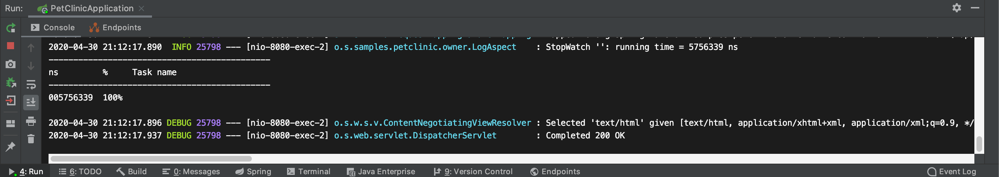

# 예제로 배우는 스프링 입문

## 목록

1. [IoC](#ioc)
2. [AOP](#aop)
3. [PSA](#psa)

## IoC

### IoC 소개

- 일반적인 제어권

  사용할 의존성은 직접 생성

  ```java
  class OwnerController {
  	private OwnerRepository owners = new OwnerRepository();
  }
  ```

- Inversion of Control

  사용할 의존성을 다른 곳에서 주입을 받는다. 사용할 의존성의 타입만 맞으면 된다.

  ```java
  class OwnerController {
  	private OwnerRepository owners;
  	public OwnerController(OwnerRepository repo){
  		this.owners = repo;
  	}
  }
  ```

  ```java
  class OwnerControllerTest{
  		@Test
  		public void create(){
  				OwnerRepository repo = new OwnerRepository();
  				OwnerController controller = new OwnerController(repo);
  		}
  }
  ```

- 의존성 주입

  스프링이 관리하는 Bean으로 등록하면 필요한 타입의 Bean을 스프링의 IoC 컨테이너가 주입을 해준다.

### IoC 컨테이너

- IoC 컨테이너

  Bean을 만들고 엮어주며 제공 `ApplicaionContext`, BeanFactory를 이용한다.

  ( `ApplicationContext`가 `BeanFactory`를 상속 받는다.)

- Bean으로 등록하는 방법

  `@Controller`, `@Bean` 등 의 annotation을 이용한다. 의존성 주입은 Bean끼리만 한다.

- IoC를 사용하는 이유

  Singleton Pattern을 이용하여 인스턴스 하나를 Application 전반에서 계속해서 재사용

### Bean

- Bean

  IoC 컨테이너가 관리하는 객체, `ApplicationContext`가 만들어서 그 안에 담고 있는 객체 annotation을 통해 Bean에 등록 했어도 직접 인스턴스를 만들었으면 Bean이 아니다

- Bean을 등록하는 방법

  1. Component Scanning

     - `@Component` annotation을 이용

       `@Repository,` @Service, `@Controlle`r 모두 `@Component` annotation을 포함

       @ComponentScan annotation이 붙어 있는 위치에서 부터 모든 하위 패키지의 모든 클래스를 확인 후 @Component annotation이 붙어 있는 클래스를 찾아 Bean으로 등록해 준다.

       ```java
       //ComponentScan이 붙어 있어 하위 폴더에 찾아서 bean에 등록
       @SpringBootApplication(proxyBeanMethods = false)
       public class PetClinicApplication {
       
       	public static void main(String[] args) {
       		SpringApplication.run(PetClinicApplication.class, args);
       	}
       
       }
       ```

  2. 직접 XML이나 자바 설정 파일에 등록

     - SampleContrller을 Bean으로 등록하기

       다음과 같은 SampleController을 Bean으로 등록하기 위해서는 Config 파일을 만들고 @Configuration과 @Bean을 이용해 Bean으로 등록 할 수 있다.

       ```java
       public class SampleController {
       
       }
       ```

       ```java
       import org.springframework.context.annotation.Bean;
       import org.springframework.context.annotation.Configuration;
       
       @Configuration
       public class SampleConfig {
       
           @Bean
           public SampleController sampleController() {
               return new SampleController();
           }
       }
       ```

### 의존성 주입

- Dependency Injection

  필요한 의존성을 어떻게 받아 올 것인가

  1. 
  2. 필드
  3. Setter

- 의존성 주입 방법

  @Autowired / @Inject를 이용 생성자, 필드 Setter에 붙일 수 있다.

  1. 생성자를 이용

     생성자에 @Autowired를 붙여 의존성을 주입 받을 수 있다. 생성자가 하나이고 생성자가 주입 받는 변수들이 Bean으로 등록되어 있으면 @Autowired를 생략가능하다. 생성자를 이용한것을 권장

     ```java
     @Controller
     class OwnerController {
     	private final OwnerRepository owners;
     
     	private VisitRepository visits;
     
     	@Autowired
     	public OwnerController(OwnerRepository clinicService, 
     												VisitRepository visits) {
     		this.owners = clinicService;
     		this.visits = visits;
     	}
     
     }
     ```

  2. 필드를 이용

     ```java
     @Controller
     class OwnerController {
     
     	@Autowired
     	private final OwnerRepository owners;
     
     	@Autowired
     	private VisitRepository visits;
     
     }
     ```

  3. Setter를 이용

     ```java
     @Controller
     class OwnerController {
     		@Autowired
         public void setVisits(VisitRepository visits) {
             this.visits = visits;
         }
     
     		private VisitRepository visits;
     }
     ```

## AOP

### AOP 소개

- AOP Aspect Oriented Programming의 약자로 관점 지향 프로그래밍이다. 의미는 다음과 같이 메소드 a, b, c 안에 공통된 AAA, BBB와 각각의 기능이 있다. 이때  AAA BBB를 묶어 별도의 메소드로 빼낸것을 의미한다.

  ```java
  class A {
  	method a() {
  		AAA
  		a함수이다 그렇다
  		BBB
  	}
  	method b() {
  		AAA
  		b함수이다
  		BBB
  	}
  
  }
  class B {
  	method c(){
  		AAA
  		B클래스의 c함수이다
  		BBB
  	}
  ```

  ```java
  class A {
  	method a() {
  		AAA
  		a함수이다 그렇다
  		BBB
  	}
  	method b() {
  		AAA
  		b함수이다
  		BBB
  	}
  
  }
  class B {
  	method c(){
  		AAA
  		B클래스의 c함수이다
  		BBB
  	}
  
  class AAABBB {
  	method aaabbb(JoinPoint point) {
  		AAA
  		point.execute()
  		BBB
  	}
  ```

- AOP를 구현하는 방법

  - 컴파일

    [A.java](http://a.java) → (AOP) → A.class

    AspectJ

  - 바이트 코드 조작

    [A.java](http://a.java) → A.class → (AOP) → 메모리

    로딩시 AOP를 설정해준다.

    AspectJ

  - 프록시 패턴

    SpringAOP가 사용하는 방법

### 프록시 패턴

- 프록시 패턴의 간단한 예시

  다음과 같이 Payment라는 interface를 구현한 Cash와 CreditCard가 있다. 이때 Store라는 Class에서 Cash를 사용하려고 할때 Cash라는 클래스의 코드의 수정없이 Store의 코드 변화 없이 여러 기능을 추가하는 방법이다

  ```java
  public interface Payment {
      void pay(int amount);
  }
  ```

  ```java
  public class Cash implements Payment {
      @Override
      public void pay(int amount) {
          System.out.println(amount + "현금결제");
      }
  }
  ```

  ```java
  public class CashPerf implements Payment{
      Payment cash = new Cash();
      @Override
      public void pay(int amount) {
  				StopWatch stopWatch = new StopWatch();
  				stopWatch.start();
  
          cash.pay(amount);
  				
  				stopWatch.stop();
  				System.out.println(stopWatch.prettyPrint());
      }
  }
  ```

  ```java
  public class Store {
      Payment payment;
  
      public Store(Payment payment) {
          this.payment = payment;
      }
  
      public void buySomething() {
          payment.pay(100);
      }
  }
  ```

- Petclinic에 적용 예시

  OwnerRepostory에는 @Transactional 이라는 annotation이 붙어 있는데 스프링에서 앞뒤로 JDBC에서 Transaction을 처리하는 코드를 더한 프록시를 만들어 준다.

  ```java
  public interface OwnerRepository extends Repository<Owner, Integer> {
  
  	/**
  	 * Retrieve {@link Owner}s from the data store by last name, returning all owners
  	 * whose last name <i>starts</i> with the given name.
  	 * @param lastName Value to search for
  	 * @return a Collection of matching {@link Owner}s (or an empty Collection if none
  	 * found)
  	 */
  	@Query("SELECT DISTINCT owner FROM Owner owner left join fetch owner.pets WHERE owner.lastName LIKE :lastName%")
  	@Transactional(readOnly = true)
  	Collection<Owner> findByLastName(@Param("lastName") String lastName);
  
  	/**
  	 * Retrieve an {@link Owner} from the data store by id.
  	 * @param id the id to search for
  	 * @return the {@link Owner} if found
  	 */
  	@Query("SELECT owner FROM Owner owner left join fetch owner.pets WHERE owner.id =:id")
  	@Transactional(readOnly = true)
  	Owner findById(@Param("id") Integer id);
  
  	/**
  	 * Save an {@link Owner} to the data store, either inserting or updating it.
  	 * @param owner the {@link Owner} to save
  	 */
  	void save(Owner owner);
  ```

### AOP 적용 예제 - 시간측정

- @LogExcutionTime 만들기

  annotation을 만들어 어디에 적용할 건지 표시해준다.

  ```java
  package org.springframework.samples.petclinic.owner;
  
  import java.lang.annotation.ElementType;
  import java.lang.annotation.Retention;
  import java.lang.annotation.RetentionPolicy;
  import java.lang.annotation.Target;
  
  @Target(ElementType.METHOD) //어디에 사용할 수 있는지
  @Retention(RetentionPolicy.RUNTIME) //annotation을 언제까지 유지할 것인가
  public @interface LogExcutionTime {
      
  }
  ```

- 실제 Aspect 만들기

  LogAspect라는 클래스를 만든후 @Around로 @LogExecutionTime이 붙어진 메소드에서만 실행 하게 한다

  ```java
  @Component //Bean으로 등록
  @Aspect
  public class LogAspect {
      
      Logger logger = LoggerFactory.getLogger(LogAspect.class);
      
      @Around("@annotation(LogExecutionTime)") 
      //Around 라는 annotation을 사용하면 joinPoint를 사용할 수 있다. 
  		//joinPoint는 @LogExecutionTime이 붙어 있는 메소드
      public Object logExecutionTime(ProceedingJoinPoint joinPoint) 
  					throws Throwable {
          StopWatch stopWatch = new StopWatch();
          stopWatch.start();
          
          Object proceed = joinPoint.proceed();
          
          stopWatch.stop();
          logger.info(stopWatch.prettyPrint());
          
          return proceed;
      }
  }
  ```

- 메소드에 @LogExcutionTime을 추가

  원하는 메소드에 @LogExecutionTime을 추가하면 성능을 추가하는 함수를 만들 수 있다.

  ```java
  @Controller
  class OwnerController {
  	//...
  
  	@GetMapping("/owners/find")
  	    @LogExecutionTime
  		public String initFindForm(Map<String, Object> model) {
  			model.put("owner", new Owner());
  			return "owners/findOwners";
  		}
  	//...
  }
  ```

  

## PSA

### PSA 소개

- Portable Service Abstraction

  환경의 변화와 관계 없이 일관된 방식의 기술로 접근 환경을 제공

- Servlet의 경우

  'owner/create'로 들어온후 get, set 메소드 매핑

  ```java
  // /owner/create
  public class OwnerCreateServlet extends HttpServlet {
      //GET
      @Override
      protected void doGet(HttpServletRequest req, HttpServletResponse resp) throws ServletException, IOException {
          super.doGet(req, resp);
      }
  
      //POST
      @Override
      protected void doPost(HttpServletRequest req, HttpServletResponse resp) throws ServletException, IOException {
          super.doPost(req, resp);
      }
  }
  ```

- SpringMVC의 경우

  Get 요청의 /owners/new를 파악하지만 아래에서는 Servlet기반으로 동작

  ```java
  	@GetMapping("/owners/new")
  	public String initCreationForm(Map<String, Object> model) {
  		Owner owner = new Owner();
  		model.put("owner", owner);
  		return VIEWS_OWNER_CREATE_OR_UPDATE_FORM;
  	}
  ```

### 스프링의 Service Abstraction

- @Controller

  요청을 매핑 할 수 있는 Controller 역할을 수행하는 클래스가 된다 안에 @GetMapping, @PostMapping으로 매핑을 한다. url이 들어 왔을때 메소드가 실행하게 한다. return으로 String을 return 하는데 resources/templates 안에 해당 View로 매핑된다.

  1. Servlet으로 설정하지 않고 매핑을 간단히 사용할 수 있다.
  2. 코드를 거의 수정하지 않고 tomcat을 다른 서버로 바꾸는 등 다른 기술을 사용할 수 있다.

  ```java
  	@GetMapping("/owners/new")
  	public String initCreationForm(Map<String, Object> model) {
  		Owner owner = new Owner();
  		model.put("owner", owner);
  		return VIEWS_OWNER_CREATE_OR_UPDATE_FORM;
  	}
  ```

- @Transactional

  transaction은 atomic하게 수행되어야 한다. 따라서 JDBC에서 실행하는 경우 여러 장치를 해야한다. 스프링에서는 @Transactional이 붙어 있으면 해당 메소드는 이런 작업들을 직접 코드를 작성하지 않아도 할 수 있다.

  1. setAutoCommit(false)등 여러 작업을 간단히 사용할 수 있다.
  2. JPATransacionManager, HibernateTransactionManager등 다른 기술을 코드 변경 없이 사용할 수 있다.

  ```java
  Connection conn = null;      
  PreparedStatement pstmt = null;
  
  try{
  conn.setAutoCommit(false);
  
  pstmt.executeUpdate("update .... ");
  pstmt.executeUpdate("insert ....");
  pstmt.executeUpdate("delete ... ");
  
  conn.commit();                                
  
  }catch(SQLException sqle){
  if(conn!=null) try{conn.rollback();}catch(SQLException sqle){}
  }
  conn.setAutoCommit(true);
  ```