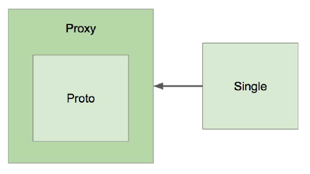
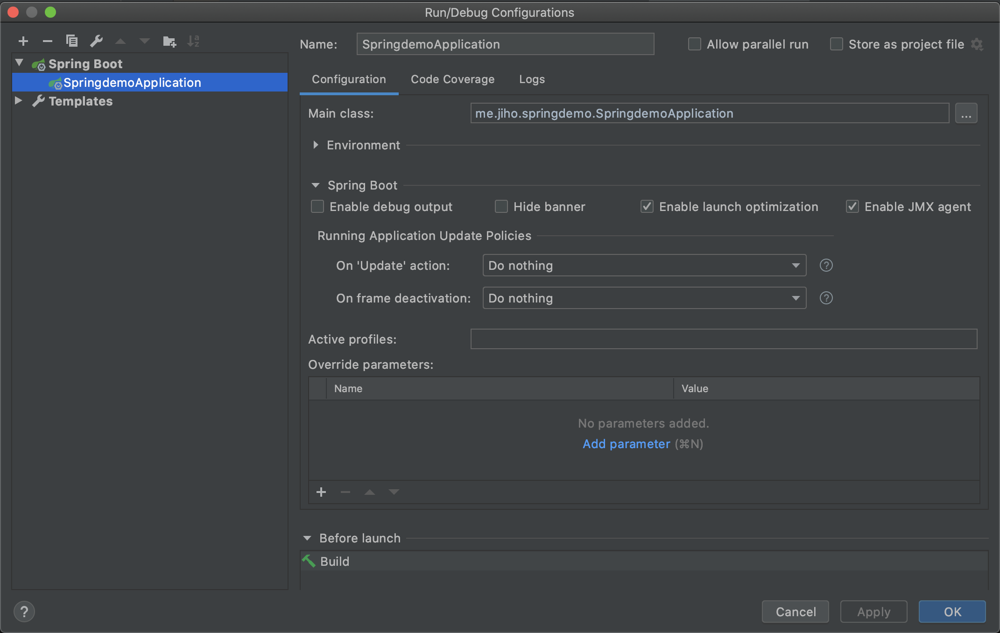

## IoC 컨테이너

### 목차

1. [스프링 IoC 컨테이너와 빈](#스프링-ioc-컨테이너와-빈)
2. [ApplicationContext와 다양한 Bean 설정 방법](#ApplicationContext와-다양한-Bean-설정-방법)
3. [@Autowired](#@Autowired)
4. [@Component와 컴포넌트 스캔](#@Component와-컴포넌트-스캔)
5. [빈의 스코프](#빈의-스코프)
6. [Environment](#Environment)
7. [MessageSource](#MessageSource)
8. [ApplicationEventPublisher](#ApplicationEventPublisher)

### 스프링 IoC 컨테이너와 빈

- Inversion of Control

  어떤 객체가 사용하는 의존 객체를 직접 만들어 사용하는게 아니라, 주입 받아 사용하는 방법

- 스프링 IoC 컨테이너 (BeanFactory)

  - 빈 설정 소스로부터 빈 정의를 읽음
  - 빈을 구성 또는 제공하는 등의 기능을 하는 빈 인스턴스 생성
  - 빈 간의 의존관계 설정, 빈 주입

- 빈

  - IoC 컨테이너가 관리하는 객체
  - Singleton Pattern을 이용해 인스턴스 하나를 Application 전반에서 계속 해서 재사용

- ApplicationContext

  - BeanFactory를 상속받아 실제 스프링 프로젝트에 사용하게 된다.
  - BeanFactory에 추가적으로 이벤트 발행, 메시지 소스 처리 기능(메시지 다국화), 리소스 로더 등의 기능를 가지고 있다.

### ApplicationContext와 다양한 Bean 설정 방법

- 빈으로 등록하는 방법

  1. ClassPathXmlApplicationContext(XML)을 이용해 등록하는 방법

     resource 폴더안에 application.xml파일을 만들고 다음과 같이 작성한다.

     ```xml
     <?xml version="1.0" encoding="UTF-8"?>
     <beans xmlns="<http://www.springframework.org/schema/beans>"
            xmlns:xsi="<http://www.w3.org/2001/XMLSchema-instance>"
            xsi:schemaLocation="<http://www.springframework.org/schema/beans> <http://www.springframework.org/schema/beans/spring-beans.xsd>">
         <bean id="bookService"
               class="me.jiho.springdemo.BookService">
             <property name="bookRepository" ref="bookRepository"/>
         </bean>
         <bean id="bookRepository"
               class="me.jiho.springdemo.BookRepository"/>
     
     </beans>
     ```

  2. AnnotationConfigApplicationContext(JAVA)를 이용해 등록하는 방법

     해당 클래스가 있는 패키지 안에 클래스를 만든다. 그 후 AnnotationConfigApplicationContext를 이용해 해당 클래스를 넣어준다.

     ```java
     import org.springframework.context.annotation.Bean;
     import org.springframework.context.annotation.Configuration;
     
     @Configuration
     public class ApplicaitonConfig {
         @Bean
         public BookRepository bookRepository() {
             return new BookRepository();
         }
         
         @Bean
         public BookService bookService() {
             BookService bookService = new BookService(bookRepository());
             return bookService;
         }
     }
     ```

     ```java
     public class SpringdemoApplication {
     
         public static void main(String[] args) {
             ApplicationContext context = new AnnotationConfigApplicationContext(ApplicaitonConfig.class);
             SpringApplication.run(SpringdemoApplication.class, args);
         }
     
     }
     ```

- 컴포넌트 스캔

  위의 방법대로 하면 번거롭다. 따라서 원하는 클래스에 @Component를 붙이고 컴포넌트 스캔 과정을 통해 빈으로 등록해 준다.

  1. XML에서 설정하는 방법

     ```xml
     <?xml version="1.0" encoding="UTF-8"?>
     <beans xmlns="<http://www.springframework.org/schema/beans>"
            xmlns:xsi="<http://www.w3.org/2001/XMLSchema-instance>"
            xmlns:context="<http://www.springframework.org/schema/context>"
            xsi:schemaLocation="<http://www.springframework.org/schema/beans> <http://www.springframework.org/schema/beans/spring-beans.xsd> <http://www.springframework.org/schema/context> <https://www.springframework.org/schema/context/spring-context.xsd>">
        
             <context:component-scan base-package="me.jiho.springdemo"/>
     
     </beans>
     ```

  2. Java에서 설정하는 방법

     @ComponentScan annotation을 이용하여 basePackegeClasses가 위치한 곳부터 ConponentScan을 한다.

     ```java
     @Configuration
     @ComponentScan(basePackageClasses = SpringdemoApplication.class)
     public class ApplicaitonConfig {
     
     }
     ```

  3. 스프링 부트의 경우

     @SpringBootApplication이라는 annotation이 @ComponentScan과 @Configuration을 모두 포함하여 아래 파일 자체가 Config파일이 된다. 번거롭게 Config 파일을 만들 필요가 없다.

     ```java
     @SpringBootApplication
     public class SpringdemoApplication {
     
         public static void main(String[] args) {
             ApplicationContext context = new AnnotationConfigApplicationContext(ApplicaitonConfig.class);
             SpringApplication.run(SpringdemoApplication.class, args);
         }
     
     }
     ```

     ```java
     @Target(ElementType.TYPE)
     @Retention(RetentionPolicy.RUNTIME)
     @Documented
     @Inherited
     @SpringBootConfiguration
     @EnableAutoConfiguration
     @ComponentScan(excludeFilters = { @Filter(type = FilterType.CUSTOM, classes = TypeExcludeFilter.class),
     		@Filter(type = FilterType.CUSTOM, classes = AutoConfigurationExcludeFilter.class) })
     public @interface SpringBootApplication {
     	//...
     }
     ```

### @Autowired

- @Autowired

  - 필요한 의존 객체의 타입에 해당하는 빈을 찾아 주입한다.
  - @Autowired(required = Bool)을 이용. 기본값을 true.
    - required = true는 반드시 주입받을 수 있는 빈이 있어야 하는 뜻.

- @Autowired를 사용 할 수 있는 위치

  1. 생성자를 이용

     - 생성자에 @Autowired를 붙여 의존성을 주입 받을 수 있다.
     - 생성자가 하나이고 생성자가 주입 받는 변수들이 Bean으로 등록되어 있으면 @Autowired가 없어도 자동적으로 의존성을 주입받는다.

     ```java
     @Controller
     class OwnerController {
     	private final OwnerRepository owners;
     
     	private VisitRepository visits;
     
     	@Autowired
     	public OwnerController(OwnerRepository clinicService, 
     												VisitRepository visits) {
     		this.owners = clinicService;
     		this.visits = visits;
     	}
     
     }
     ```

  2. 필드를 이용

     ```java
     @Controller
     class OwnerController {
     
     	@Autowired
     	private final OwnerRepository owners;
     
     	@Autowired
     	private VisitRepository visits;
     
     }
     ```

  3. Setter를 이용

     ```java
     @Controller
     class OwnerController {
     		@Autowired
         public void setVisits(VisitRepository visits) {
             this.visits = visits;
         }
     
     		private VisitRepository visits;
     }
     ```

- 같은 타입의 빈이 여러개인 경우

  - BookRepository를 구현한 @Repository annotation이 붙은 클래스가 여러 개인 경우 의존성 주입을 해줄 수 없다. 아래의 방식들을 사용해야 한다.

  ```java
  public interface BookRepository {
  }
  ```

  ```java
  import org.springframework.stereotype.Repository;
  
  @Repository
  public class MyBookRepository implements BookRepository{
  }
  ```

  ```java
  import org.springframework.stereotype.Repository;
  
  @Repository
  public class YourBookRepository implements BookRepository{
  }
  ```

  1. @Primary를 이용

     @Primary annotaion이 붙은 클래스를 주입해준다.

     ```java
     import org.springframework.context.annotation.Primary;
     import org.springframework.stereotype.Repository;
     
     @Repository
     @Primary
     public class MyBookRepository implements BookRepository{
     }
     ```

  2. @Qualifier을 이용

     주입하고 싶은 빈의 이름을 @Qualifier에 넣어준다.

     ```java
     import org.springframework.beans.factory.annotation.Autowired;
     import org.springframework.beans.factory.annotation.Qualifier;
     import org.springframework.stereotype.Service;
     
     @Service
     public class BookService {
         BookRepository bookRepository;
     
         @Autowired 
         public BookService(@Qualifier("myBookRepository") BookRepository bookRepository) {
             this.bookRepository = bookRepository;
         }
     }
     ```

  3. 해당 타입의 빈 모두 받기

     리스트 타입으로 해당 타입의 빈 모두 받기

     ```java
     @Service
     public class BookService {
         List<BookRepository> bookRepository;
     
         @Autowired
         public BookService( List<BookRepository> bookRepository) {
             this.bookRepository = bookRepository;
         }
     }
     ```

  4. 필드의 이름을 빈의 이름과 똑같이 만들기

     필드의 이름과 동일한 빈을 주입해 준다. 권장하지 않음

     ```java
     @Service
     public class BookService {
         BookRepository myBookRepository;
     
         @Autowired 
         public BookService( BookRepository bookRepository) {
             this.myBookRepository = bookRepository;
         }
     }
     ```

- 동작원리

  AutowierdAnnotaionBeanPostProcessor가 Initializing 전에 빈을 찾아서 주입을 해준다.

  BeanFactory → BeanPostProcessor → AutowiredAnnotationBeanPostProcessor

### @Component와 컴포넌트 스캔

- 컴포넌트스캔 주요기능

  1. 스캔 위치 설정

     컴포넌트 스캔이 붙어있는 패키지 밖에는 스캔하지 않는다.

  2. @Filter

     필터를 이용해 어떤 annotation을 스캔 할 지 또는 하지 않을 지 정할 수 있다.

     ```java
     @Target(ElementType.TYPE)
     @Retention(RetentionPolicy.RUNTIME)
     @Documented
     @Inherited
     @SpringBootConfiguration
     @EnableAutoConfiguration
     @ComponentScan(excludeFilters = { 
     		@Filter(type = FilterType.CUSTOM, classes = TypeExcludeFilter.class),
     		@Filter(type = FilterType.CUSTOM, classes = AutoConfigurationExcludeFilter.class) })
     public @interface SpringBootApplication {
     }
     ```

- @Component annotation

  - @Repository, @Service, @Controller, @Configuration을 이용한다.
    - @Repository, @Service, @Controller, @Configuration 내에 @Component가 이미 붙어있다.
  - 실행 시 모든 빈을 만들어야 하기 때문에 구동시간이 오래 걸린다는 단점이 있다.
  - 다음과 같이 메소드를 이용해 빈을 등록하는 방법도 제공하고 있다. 하지만 불편

  ```java
  import org.springframework.boot.SpringApplication;
  import org.springframework.boot.autoconfigure.SpringBootApplication;
  import org.springframework.context.ApplicationContext;
  import org.springframework.context.ApplicationContextInitializer;
  import org.springframework.context.ConfigurableApplicationContext;
  import org.springframework.context.annotation.AnnotationConfigApplicationContext;
  import org.springframework.context.support.GenericApplicationContext;
  
  @SpringBootApplication
  public class SpringdemoApplication {
  
      public static void main(String[] args) {
  //        SpringApplication.run(SpringdemoApplication.class, args);
          var app = new SpringApplication(SpringdemoApplication.class);
          app.addInitializers(new ApplicationContextInitializer<GenericApplicationContext>() {
              @Override
              public void initialize(GenericApplicationContext configurableApplicationContext) {
                  configurableApplicationContext.registerBean(MyBookRepository.class);
              }
          });
          app.run(args);
      }
  
  }
  ```

- 동작원리

  @ComponentScan에 스캔할 패키지와 annotation에 대한 정보가 있고, ConfigurationClassPostProcessor라는 BeanFactoryPostProcessor에 의해 수행된다.

### 빈의 스코프

- 스코프

  - Singleton, Prototype, Request, Session 등 다양한 Scope가 존재
  - 스프링은 기본적으로 bean을 Singleton으로 관리

  1. 싱글톤

     - IoC 컨테이너 안에 하나의 인스턴스만 존재
     - scope가 명시적으로 지정되지 않으면 기본적으로 Singleton으로 생성 프로퍼티가 공유된다.

     ```java
     @Component
     public class Singleton {
     }
     ```

  2. 프로토타입

     - bean이 주입될 때마다 새로운 인스턴스가 생성되어 주입

     ```java
     @Component
     @Scope("prototype")
     public class Prototype {
     }
     ```

- Singleton Bean이 Prototype Bean을 참조하는 경우

  Singleton Bean의 인스턴스는 한 번만 만들어진다. 따라서 Singleton Bean을 여러 번 주입받아도 Prototype Bean이 업데이트가 되지 않는다.

- Singleton Bean에서 Prototype Bean을 업데이트 하는 방법

  1. scoped-proxy이용

     Prototype의 Bean을 프록시로 wrapping해 Singleton Bean이 Prototype의 Bean을 직접 참조하지 않고 Proxy로 참조하게 한다.

     ```java
     @Component
     @Scope(value = "prototype", proxyMode = ScopedProxyMode.TARGET_CLASS)
     public class Prototype {
     }
     ```

     

  2. Object-Provider이용

     ObjectProvider<T>를 이용한다. 코드의 수정이 필요하다. 따라서 scoped-proxy를 주로 사용함.

     ```java
     @Component
     public class Singleton {
         @Autowired
         private ObjectProvider<Prototype> prototype;
     
         public Prototype getPrototype() {
             return prototype.getIfAvailable();
         }
     }
     ```

### Environment

- EnvironmentCapable 인터페이스

  - 프로파일과 프로퍼티를 다루는 인터페이스
  - ApplicationContext가 구현하고 있는 인터페이스 중 하나

- 프로파일

  - Bean들의 그룹
  - Enviroment는 활성화 할 프로파일 확인 및 설정함.

  ```java
  import org.springframework.core.env.Environment;
  import org.springframework.stereotype.Component;
  
  import java.util.Arrays;
  
  @Component
  public class AppRunner implements ApplicationRunner {
  
      @Autowired
      ApplicationContext ctx;
  
      @Override
      public void run(ApplicationArguments args) throws Exception {
          Environment environment = ctx.getEnvironment();
          System.out.println(Arrays.toString(environment.getActiveProfiles()));
      }
  }
  ```

  - 프로파일의 사용이유

    - 태스트 환경에서는 A라는 Bean을 사용하고 배포 환경에서는 B라는 Bean을 사용하고 싶을 때 등

  - 프로파일 정의하기

    1. 클래스에 정의

       - @Configuration과 @Profile annotation을 사용.
       - @Profile로 해당 클래스를 사용하고자 하는 범위를 지정.
       - 아래와 같이 @Profile을 이용하여 @Configuration을 등록한 경우, test profile일때만 적용이 되는 bean 설정파일을 만들 수 있다.

       ```java
       public interface BookRepository {
       }
       ```

       ```java
       import org.springframework.stereotype.Repository;
       
       public class TestBookRepository implements BookRepository{
       }
       ```

       ```java
       import org.springframework.context.annotation.Bean;
       import org.springframework.context.annotation.Configuration;
       import org.springframework.context.annotation.Profile;
       
       @Configuration
       @Profile("test")
       public class TestConfiguration {
       
           @Bean
           public BookRepository bookRepository() {
               return new TestBookRepository()();
           }
       
       }
       ```

       @Component에 직접 정의 가능하다.

       ```java
       import org.springframework.context.annotation.Profile;
       import org.springframework.stereotype.Repository;
       
       @Repository
       @Profile("test")
       public class TestBookRepository implements BookRepository{
       }
       ```

       문자열에 !, &등을 이용할 수 있다.

       ~~~java
       ```java
       import org.springframework.context.annotation.Profile;
       import org.springframework.stereotype.Repository;
       
       @Repository
       @Profile("!test")
       // test가 아닌 영역에서 사용 가능한 클래스
       public class TestBookRepository implements BookRepository{
       }
       ~~~

       ```
       
       ```

    2. 메소드에 정의

       ```java
       import org.springframework.context.annotation.Bean;
       import org.springframework.context.annotation.Configuration;
       import org.springframework.context.annotation.Profile;
       
       @Configuration
       public class TestConfiguration {
       
           @Bean @Profile("test")
           public BookRepository bookRepository() {
               return new TestBookRepository()();
           }
       
       }
       ```

  - 프로파일 설정하기

    Run/Debug Configuration에서 Active Profile을 이용한다.

    

- 프로퍼티

  - 다양한 방법으로 정의할 수 있는 설정값
  - Environment를 이용해 프로퍼티 소스 설정 및 프로퍼티 값을 가져올 수 있다.

  ```java
  import org.springframework.beans.factory.annotation.Autowired;
  import org.springframework.boot.ApplicationArguments;
  import org.springframework.boot.ApplicationRunner;
  import org.springframework.context.ApplicationContext;
  import org.springframework.core.env.Environment;
  import org.springframework.stereotype.Component;
  
  import java.util.Arrays;
  
  @Component
  public class AppRunner implements ApplicationRunner {
  
      @Autowired
      ApplicationContext ctx;
      @Override
      public void run(ApplicationArguments args) throws Exception {
          Environment environment = ctx.getEnvironment();
          environment.getProperty("app.name");
      }
  }
  ```

  - 프로퍼티의 우선순위

    1. ServletConfig 매개변수
    2. ServletContext 매개변수
    3. JNDI
    4. JVM 시스템 프로퍼티(-Dkey="vakye")
    5. JVM 시스템 환경 변수(운영 체제 환경 변수)

  - @PropertySource

    - Enviroment를 통해 프로퍼티를 추가하는 방법
    - @PropertySource를 통해 사용자 정의 properties 파일을 프로퍼티로 추가할 수 있다.
    - VM 옵션보다 우선순위가 낮다.

    ```java
    import org.springframework.boot.SpringApplication;
    import org.springframework.boot.autoconfigure.SpringBootApplication;
    import org.springframework.context.ApplicationContext;
    import org.springframework.context.ApplicationContextInitializer;
    import org.springframework.context.ConfigurableApplicationContext;
    import org.springframework.context.annotation.AnnotationConfigApplicationContext;
    import org.springframework.context.annotation.PropertySource;
    import org.springframework.context.support.GenericApplicationContext;
    
    @SpringBootApplication
    @PropertySource("classpath:/app.properties")
    public class SpringdemoApplication {
    
        public static void main(String[] args) {
            SpringApplication.run(SpringdemoApplication.class, args);
        }
    
    }
    ```

### MessageSource

- MessageSource

  - 국제화(i18n)을 제공하는 인터페이스.
  - 메시지 설정파일을 모아놓고 각 국가마다 로컬라이징을 함으로서 쉽게 각 지역에 맞춘 메시지를 제공 할 수 있음
  - ApplicationContext가 MessageSource를 구현하고 있다.

- MessageSource 사용하기

  스프링 부트를 사용하면 별다른 설정 없이 messages.properties, messages_ko_KR.properties 등의 파일을 Resource에 넣어주면 사용 할 수 있다.

  ```
  greeting= Hello, {0}
  ```

  ```
  greeting= 안녕, {0}
  ```

  ```java
  port org.springframework.beans.factory.annotation.Autowired;
  import org.springframework.boot.ApplicationArguments;
  import org.springframework.boot.ApplicationRunner;
  import org.springframework.context.ApplicationContext;
  import org.springframework.context.MessageSource;
  import org.springframework.core.env.Environment;
  import org.springframework.stereotype.Component;
  
  import java.util.Arrays;
  import java.util.Locale;
  
  @Component
  public class AppRunner implements ApplicationRunner {
  
      @Autowired
      MessageSource messageSource;
      @Override
      public void run(ApplicationArguments args) throws Exception {
          System.out.println(messageSource.getMessage("greeting", new String[]{"jiho"}, Locale.KOREA));
      }
  }
  ```

- 리로딩 기능이 있는 메시지 소스 사용하기

  - ReloadableResourceBundleMessageSource를 이용하여 프로퍼티 파일을 갱신하면서 읽을 수 있다.
  - 아래와 같이 MessageSource의 Bean을 ReloadableResourceBundleMessageSource로 만들어 준다.
  - setCacheSeconds 메서드는 프로퍼티 파일 갱신을 감지할 시간 간격이다.

  ```java
  @SpringBootApplication
  public class SpringdemoApplication {
  
      public static void main(String[] args) {
          SpringApplication.run(SpringdemoApplication.class, args);
      }
  
      @Bean
      public MessageSource messageSource() {
          var messageSource = new ReloadableResourceBundleMessageSource();
          messageSource.setBasename("classpath:/messages");
          messageSource.setDefaultEncoding("UTF-8");
          messageSource.setCacheSeconds(3);
          return messageSource;
      }
  }
  ```

  - ApplicationRunner에 다음과 같이 while문을 이용해서 출력하면 build를 할 때 프로퍼티파일이 갱신이 적용되는 것을 확인 할 수 있다.

  ```java
  @Component
  public class AppRunner implements ApplicationRunner {
  
      @Autowired
      MessageSource messageSource;
      @Override
      public void run(ApplicationArguments args) throws Exception {
          while(true) {
              System.out.println(messageSource.getMessage("greeting", new String[]{"jiho"}, Locale.KOREA));
              Thread.sleep(1000);
          }
      }
  }
  ```

### ApplicationEventPublisher

- ApplicationEventPublisher

  - 이벤트 프로그래밍에 필요한 인터페이스를 제공.
  - ApplicationContext가 상속받고 있다.

- 이벤트 만들기

  - ApplicationEvent를 상속받으면 된다.
  - 스프링 4.2부터는 ApplicationEvent를 상속 받지 않아도 이벤트로 사용할 수 있다.

  ```java
  import org.springframework.context.ApplicationEvent;
  
  public class MyEvent extends ApplicationEvent {
      private int data;
  
      public MyEvent(Object source) {
          super(source);
      }
  
      public MyEvent(Object source, int data) {
          super(source);
          this.data = data;
      }
  
      public int getData() {
          return data;
      }
  }
  ```

- 이벤트를 발생시키는 방법

  ApplicationEventPublisher의 publishEvent 메소드를 이용해 이벤트를 발생 시킬수 있다.

  ```java
  @Component
  public class AppRunner implements ApplicationRunner {
  
      @Autowired
      ApplicationEventPublisher publisher;
  
      @Override
      public void run(ApplicationArguments args) throws Exception {
          publisher.publishEvent(new MyEvent(this, 100));
      }
  
  }
  ```

  ApplicationEvent를 extend하지 않아도 가능하다.

  ```java
  public class MyEvent  {
      private int data;
      private Object source;
  
      public MyEvent(int data, Object source) {
          this.data = data;
          this.source = source;
      }
  
      public Object getSource() {
          return source;
      }
  
      public int getData() {
          return data;
      }
  }
  ```

- 이벤트를 처리하는 방법

  ApplicationListener<T>를 구현한 클래스를 만들어 빈으로 등록

  ```java
  import org.springframework.context.ApplicationListener;
  import org.springframework.stereotype.Component;
  
  @Component
  public class MyEventHandler implements ApplicationListener<MyEvent> {
      @Override
      public void onApplicationEvent(MyEvent event) {
          
      }
  }
  ```

  @EventListener를 사용해서도 만들수 있다.

  ```java
  import org.springframework.context.ApplicationListener;
  import org.springframework.context.event.EventListener;
  import org.springframework.stereotype.Component;
  
  @Component
  public class MyEventHandler {
  
      @EventListener
      public void handle(MyEvent myEvent){
          System.out.println("이벤트 받음 " + myEvent.getData());
      }
  
  }
  ```

- 이벤트 순서 정하기: @Order

  해당 이벤트를 처리하는 핸들러가 여러 개인 경우 @Order를 이용해 순서를 정할 수 있다.

  ```java
  @Component
  public class MyEventHandler {
  
      @EventListener
      @Order(Ordered.HIGHEST_PRECEDENCE)
      public void handle(MyEvent myEvent){
          System.out.println("이벤트 받음 " + myEvent.getData());
      }
  
  }
  ```

- 비동기적으로 이벤트를 처리하려면: @Async

  기본적으로는 synchronized 하게 수행된다. 실행 순서는 보장하지 않는다.

  ```java
  @Component
  public class MyEventHandler {
      @EventListener
      @Async
      public void handle(MyEvent myEvent){
          System.out.println("이벤트 받음 " + myEvent.getData());
      }
  }
  ```

  ```java
  @SpringBootApplication
  @EnableAsync
  public class SpringdemoApplication {
  
      public static void main(String[] args) {
          SpringApplication.run(SpringdemoApplication.class, args);
      }
  
  }
  ```

- 스프링이 기본적으로 제공하는 이벤트

  1. ContextRefreshedEvent

     AppicationContext를 초기화 하거나 리프레시 했을때 발생

  2. ContextStartedEvent

     ApplicationContext를 start()하여 라이프사이클 빈들이 시작 신호를 받은 시점에 발생.

  3. ContextStoppedEvent

     ApplicationContext를 stop()하여 라이프사이클 빈들이 정지 신호를 받은 시점에 발생.

  4. ContextClosedEvent

     ApplicationContext를 close() 하여 싱글톤 빈이 소멸되는 시점에 발생

  5. RequestHandledEvent

     HTTP 요청을 처리했을 때 발생

     ```java
     @EventListener
         public void handle(RequestHandledEvent event) {
             System.out.println("RequestHandledEvent 발생");
         }
     ```

### IoC 컨테이너: ResourceLoader

- ResourceLoader

  리소스를 읽어오는 기능을 제공하는 인터페이스, ApplicationContext 가 상속받고 있다. resource 폴더에 'test.txt'를 만들고 안에 'hello'라고 작성했다.

  ```java
  import org.springframework.beans.factory.annotation.Autowired;
  import org.springframework.boot.ApplicationArguments;
  import org.springframework.boot.ApplicationRunner;
  import org.springframework.core.io.Resource;
  import org.springframework.core.io.ResourceLoader;
  import org.springframework.stereotype.Component;
  
  import java.nio.file.Files;
  import java.nio.file.Path;
  
  @Component
  public class AppRunner implements ApplicationRunner {
      
      @Autowired
      ResourceLoader resourceLoader;
      @Override
      public void run(ApplicationArguments args) throws Exception {
          Resource resource = resourceLoader.getResource("classpath:test.txt");
          System.out.println(resource.exists());
          System.out.println(resource.getDescription());
          System.out.println(Files.readString(Path.of(resource.getURI())));
  
      }
  }
  ```