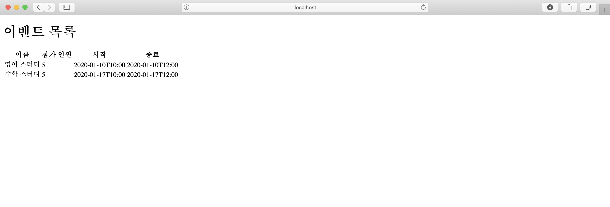

## 스프링 웹 MVC 소개

### 스프링 웹 MVC

- MVC 패턴

  MVC는 Model View Controller로 애플리케이션을 세 가지 역할로 구분하여 개발하는 방법론이다.

  1. Model : 도메인 객체 또는 DTO(Data Transfer Object)로 화면에 전달할 또는 화면에서 전달 받은 데이터를 담고 있는 객체이다
  2. View : 데이터를 보여주는 역할로, HTML, JSON, XML 등 이 있다.
  3. Controller : 사용자 입력을 받아 Model 객체의 데이터를 변경하거나, Model 객체를 View에 전달하는 역 할을 한다.

  - MVC 패턴의 장점
    - 동시 다발적으로 개발이 가능 : 백앤드 개발자와 프론트앤드 개발자가 독립적으로 개발을 진행
    - 높은 결합도 : 논리적으로 관련있는 기능을 하나의 컨트롤러로 묶거나, 특정 모델과 관련있는 뷰를 그룹하 가능
    - 개발 용이성 : 구분되어 있어 코드 수정이 편리
    - 한 모델에 대한 여러 형태의 뷰를 가질 수 있다.
  - MVC 패턴의 단점
    - 코드 일관성 유지에 노력이 필요
    - 높은 학습곡선

- 스프링 MVC에서 Model, View, Controller

  1. Model

     Controller에서 View로 객체를 전달하는데 사용된다. Controller 메소드에 input으로 값을 넘겨 주면 된다. 스프링에서 기본적으로 제공하는 Model 인터페이스가 있는데 이는 Map<String, Object> 형식이다. 아래와 같이 Event 클래스와 List<Event>를 return하는 EventService 클레스가 있다.

     ```java
     import lombok.*;
     import java.time.LocalDateTime;
     
     @Getter
     @Setter
     @Builder
     @NoArgsConstructor
     @AllArgsConstructor
     public class Event {
     
         private String name;
         private int limitOfEnrollment;
         private LocalDateTime startDateTime;
         private LocalDateTime endDateTime;
     }
     ```

     ```java
     import org.springframework.stereotype.Service;
     
     import java.time.LocalDateTime;
     import java.util.List;
     
     @Service
     public class EventService {
         public List<Event> getEvents() {
             Event event1 = Event.builder()
                     .name("영어 스터디")
                     .limitOfEnrollment(5)
                     .startDateTime(LocalDateTime.of(2020, 1, 10, 10, 0))
                     .endDateTime(LocalDateTime.of(2020, 1, 10, 12, 0))
                     .build();
     
             Event event2 = Event.builder()
                     .name("수학 스터디")
                     .limitOfEnrollment(5)
                     .startDateTime(LocalDateTime.of(2020,1,17,10,0))
                     .endDateTime(LocalDateTime.of(2020, 1, 17,12,0))
                     .build();
     
             return List.of(event1, event2);
     
         }
     }
     ```

     이 때 모델의 사용법은 Controller의 메소드에 input으로 Model을 넣고 이를 메소드에서 key 와 value 형식으로 넣어주면된다.

     ```java
     @GetMapping("/event")
         public String events(Model model) { //model은 map이라고 생각 key, value
             model.addAttribute("events", eventService.getEvents());
             return "events";
         }
     ```

  2. Controller

     @Controller annotation을 이용해 bean으로 등록한다. @GetMapping()을 통해 해당 url로 요청이 들어오면 해당 메소드가 실행된다.

     ```java
     package me.jiho.springmvcdemo;
     
     import org.springframework.beans.factory.annotation.Autowired;
     import org.springframework.stereotype.Controller;
     import org.springframework.ui.Model;
     import org.springframework.web.bind.annotation.GetMapping;
     import org.springframework.web.bind.annotation.RequestMapping;
     import org.springframework.web.bind.annotation.RequestMethod;
     
     @Controller
     public class EventController {
     
         @Autowired
         EventService eventService;
         //@RequestMapping(value = "/event", method = RequestMethod.GET)
         @GetMapping("/event")
         public String events(Model model) { //model은 map이라고 생각 key, value
             model.addAttribute("events", eventService.getEvents());
             return "events";
         }
     }
     ```

  3. View

     스프링부트에서 Controller의 메소드에 return 하는 String과 같은 값의 html 파일을 resources 폴더에서 찾는다 동적은 View는 resources/template 에서 찾으므로 해당 디렉토리에 events.html을 다음과 같이 만든다. 다음은 타임리프를 사용한 예시이다.

     ```html
     <!DOCTYPE html>
     <html lang="en" xmlns:th="<http://www.thymeleaf.org>">
     <head>
         <meta charset="UTF-8">
         <title>Title</title>
     </head>
     <body>
         <h1>이밴트 목록</h1>
         <table>
             <tr>
                 <th>이름</th>
                 <th>참가 인원</th>
                 <th>시작</th>
                 <th>종료</th>
             </tr>
             <tr th:each="event: ${events}">
                 <td th:text="${event.name}"></td>
                 <td th:text="${event.limitOfEnrollment}"></td>
                 <td th:text="${event.startDateTime}"></td>
                 <td th:text="${event.endDateTime}"></td>
             </tr>
         </table>
     </body>
     </html>
     ```

     