## 서블릿

### 목차

1. [서블릿 소개](#서블릿-소개)
2. [서블릿 어플리케이션 개발](#서블릿-어플리케이션-개발)
3. [서블릿 리스너](#서블릿-리스너)
4. [서블릿 필터](#서블릿-필터)

### 서블릿 소개

- 서블릿(Servlet)

  - JavaEE가 개발용 스팩과 API 제공
  - 외부 요청마다 프로세스보다 가벼운 쓰레드로 응답
  - CGI에 비해 빠르고, 플랫폼 독립적, 그리고 보안에 뛰어나다는 장점을 가지고 있다.

- 서블릿 엔진 또는 서블릿 컨테이너

  서블릿 스팩을 준수하는 컨테이너로 톰캣, 제티, 언더토 등 이 있다. 세션관리, 네트워크 서비스, MIME 기반 메시지 인코딩 디코딩, 서블릿 생명주기 관리 등의 역할을 한다. 서블릿 어플리케이션은 서블릿 컨테이너가 실행시킬수 있기 때문에 서블릿 컨테이너를 사용해야한다.

- 서블릿 생명주기

  서블릿 컨테이너가 서블릿을 실행하는 방법이다.

  - 서블릿 컨테이너가 서블릿 인스턴스의 init() 메소드를 호출하여 초기화 한다.

  - 서블릿이 초기화 된 다음부터 클라이언트의 요청을 처리할 수 있다. 각 요청은 별도의 쓰레드로 처리하고 이때 서블릿 인스턴스의 service() 메소드를 호출한다.

    HTTP 요청을 받고 클라이언트로 보낼 HTTP 응답을 만든다.

    service() 메소드는 HTTP 메소드에 따라 doGet() doPost() 등으로 처리를 위임한다

  - 서블릿컨테이너 판단에 따라 해당 서블릿을 메모리에서 내려야 할 시점에 destroy()를 호출한다.

### 서블릿 어플리케이션 개발

- 프로젝트 생성

  스프링이 아닌 서블릿으로 어플리케이션을 개발하는 예시이다. 프로젝트 생성시 스프링이 아닌 maven의 archetype으로 프로젝트를 생성

  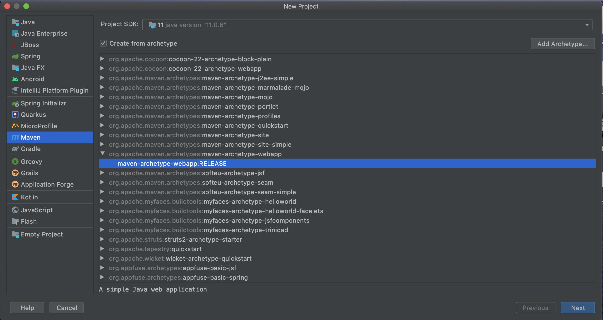

  pom.xml로 들어가서 의존성으로 sevlet을 추가 시킨다. 여기서 scope의 의미는 test인 경우 test를 실행하는 경우에만 사용가능, provided인경우 런타임 시점에는 빠지고 컴파일 시점에서는 사용 패키징시 제외되고 실행시에는 컨테이너에서 제공된다.

  ```xml
  <!-- <https://mvnrepository.com/artifact/javax.servlet/javax.servlet-api> -->
  <dependency>
      <groupId>javax.servlet</groupId>
      <artifactId>javax.servlet-api</artifactId>
      <version>4.0.1</version>
      <scope>provided</scope>
  </dependency>
  ```

  main에 java라는 폴더를 만들고 Sources로 지정해준다

  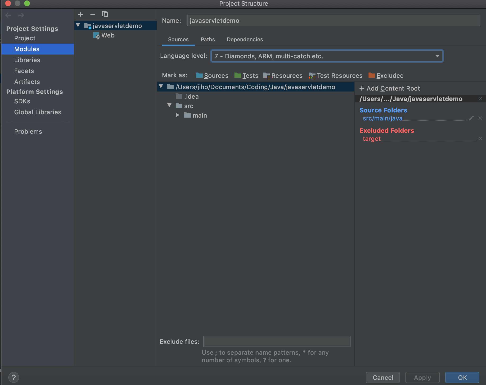

  다음으로 패키지 폴더를 생성해 주면 된다.

- 서블릿 구현

  패키지 폴더 안에 다음과 같이 서블릿을 구현해 준다. init, doGet, destry안에 각각 언제 호출되는지 알아보기 위해 문구를 넣었다.

  ```java
  package me.jiho;
  
  import javax.servlet.ServletException;
  import javax.servlet.http.HttpServlet;
  import javax.servlet.http.HttpServletRequest;
  import javax.servlet.http.HttpServletResponse;
  import java.io.IOException;
  
  public class HelloServlet extends HttpServlet {
      @Override
      public void init() throws ServletException {
          System.out.println("init");
      }
  
      @Override
      protected void doGet(HttpServletRequest req, 
  												HttpServletResponse resp) 
  													throws ServletException, IOException {
          System.out.println("doGet");
          resp.getWriter().println("<html>");
          resp.getWriter().println("<head>");
          resp.getWriter().println("</head>");
          resp.getWriter().println("<body>");
          resp.getWriter().println("<h1>Hello Servlet</h1>");
          resp.getWriter().println("</body>");
          resp.getWriter().println("</html>");
      }
  
      @Override
      public void destroy() {
          System.out.println("destroy");
      }
  }
  ```

- 서블릿 실행

  서블릿은 실행시에는 서블릿 컨테이너에 배포를 해야 실행이 가능하다. 따라서 AddConfiguration을 눌러 +를 눌러 tomcat을 넣어준다.

  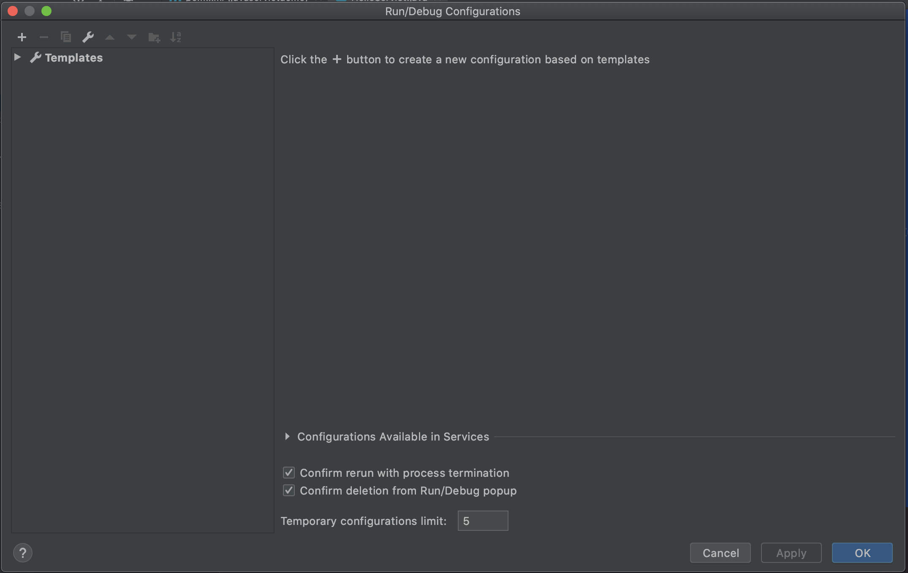

  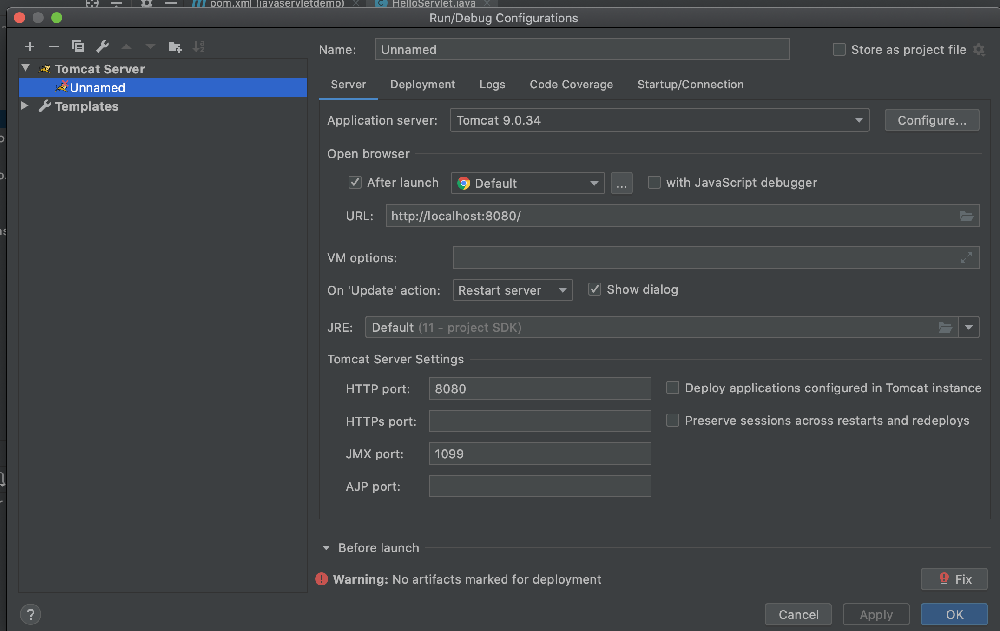

  Deployment war를 war exploded로 바꾸어 준다. war의 압축을 풀은 상태로 tomcat에 배포한다.

  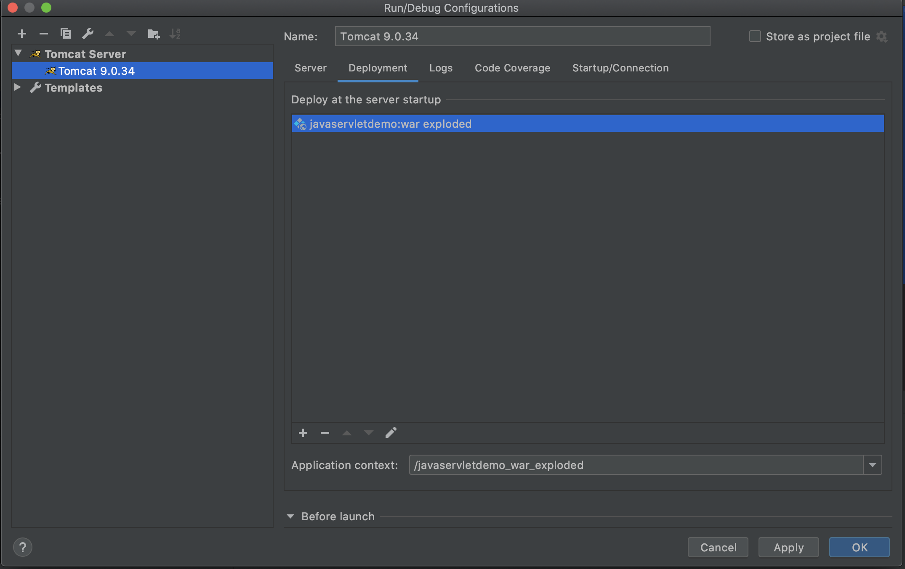

  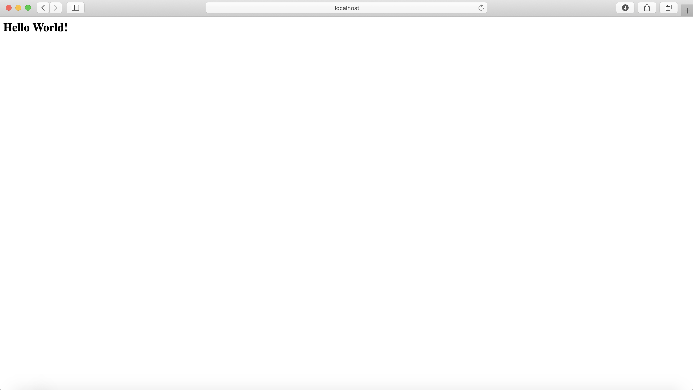

- 서블릿 등록하기

  서블릿을 등록하기 위해서는 webapp/WEB-INF/web.xml에 서블릿을 추가하면 된다 servlet 태그를 이용해 hello 라는 이름으로 HelloServlet을 등록하고 <servlet-mapping>으로 url과 서블릿을 매핑시킨다.

  ```xml
  <web-app>
    <display-name>Archetype Created Web Application</display-name>
  
    <servlet>
      <servlet-name>hello</servlet-name>
      <servlet-class>me.jiho.HelloServlet</servlet-class>
    </servlet>
  
    <servlet-mapping>
      <servlet-name>hello</servlet-name>
      <url-pattern>/hello</url-pattern>
    </servlet-mapping>
  </web-app>
  ```

  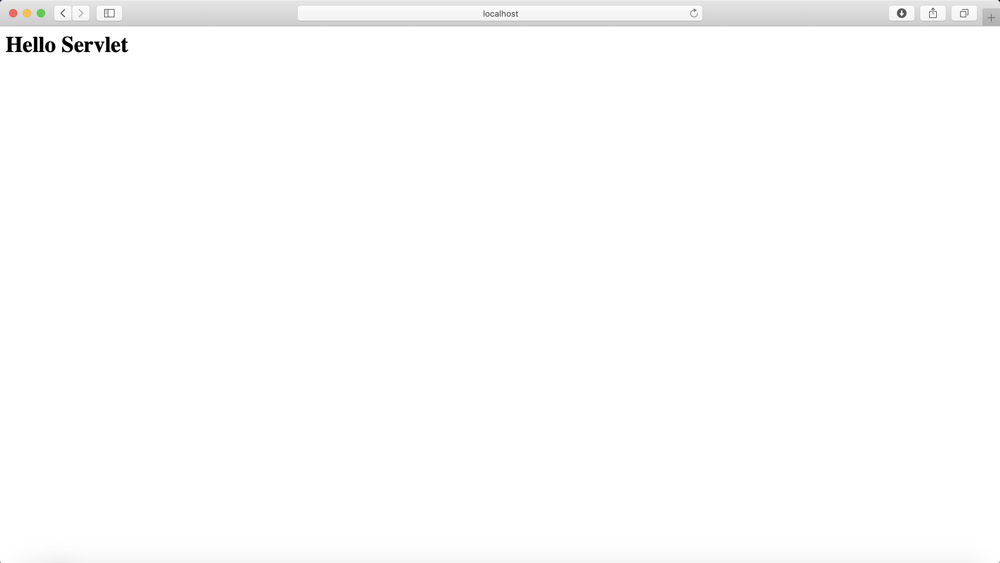

  다음 화면을 띄우고 새로고침을 수행하였다. 이때 init은 처음에 한번만 수행되고 다음에는 doget만 실행되는 것을 확인 할 수 있다.

  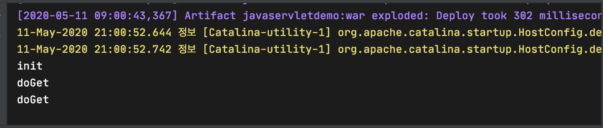

### 서블릿 리스너

- 서블릿 리스너

  웹 어플리케이션에서 발생하는 주요 이벤트를 감지하고 각 이벤트에 특별한 작업이 필요한 경우에 사용할 수 있다. 예시로는 서블릿 컨테이너 실행시 데이터베이스 커넥션을 만들어 놓고 여러 서블릿에서 이를 사용할 수 있다.

- 서블릿 리스너의 종류

  1. 서블릿 컨텍스트 수준의 이벤트
     - 컨텍스트 라이프사이클 이벤트
     - 컨텍스트 에트리뷰트 변경 이벤트
  2. 세션 수준의 이벤트
     - 세션 라이프 사이클 이벤트
     - 세션 에트리뷰트 변경 이벤트

- 서블릿 리스너 생성

  MyLister 클래스를 다음과 같이 만들어 준다.

  ```java
  import javax.servlet.ServletContextEvent;
  import javax.servlet.ServletContextListener;
  
  public class MyListener implements ServletContextListener {
      @Override
      public void contextInitialized(ServletContextEvent sce) {
          System.out.println("Context Init");
          sce.getServletContext().setAttribute("name", "jiho");
      }
  
      @Override
      public void contextDestroyed(ServletContextEvent sce) {
          System.out.println("Context Destroy");
  
      }
  }
  ```

  web.xml에 Listener를 등록해 준다.

  ```xml
  <listener>
      <listener-class>me.jiho.MyListener</listener-class>
  </listener>
  ```

  기존의 서블릿에서 리스너의 값을 가지고 오게 변경한다.

  ```java
  @Override
      protected void doGet(HttpServletRequest req, HttpServletResponse resp) 
  													throws ServletException, IOException {
          System.out.println("doGet");
          resp.getWriter().println("<html>");
          resp.getWriter().println("<head>");
          resp.getWriter().println("</head>");
          resp.getWriter().println("<body>");
          resp.getWriter().println(
  							"<h1>Hello " +getServletContext().getAttribute("name") + "</h1>");
          resp.getWriter().println("</body>");
          resp.getWriter().println("</html>");
      }
  ```

### 서블릿 필터

- 서플릿 필터

  들어온 요청(doGet, doPost)을 서블릿으로 보내고, 또 서블릿이 작성한 응답을 클라이언트로 보내기 전에 특별한 처리가 필요한 경우 사용할 수 있다.  리스너는 서블릿 컨테이너 위에 필터는 서블릿컨테이너가 요청을 받은 후에 적용된다.

  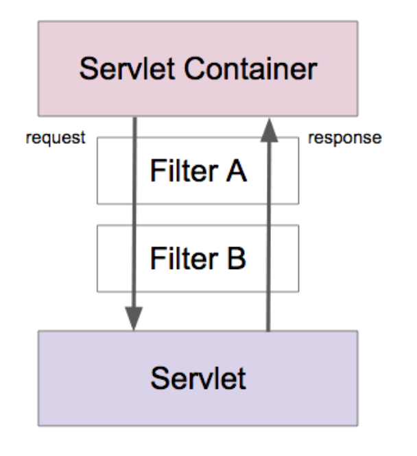

  - 여러개의 서블릿에 추가적은 작업 또는 특정한 url 패턴에 추가적인 작업이 가능
  - 동시다발적으로 적용되는 것이 아니라 web.xml에 작성한 순서대로 적용된다.
  - 반드시 다음 체인으로 적용되도록 작성을 해주어야 서블릿까지 전달이 된다.

- 서블릿 필터 생성

  MyFilter를 다음과 같이 만들어 준다. 필터를 만들때에는 filterChain.doFilter 메소드로 다음 체인에 연결을 해주어야 한다.

  ```java
  import javax.servlet.*;
  import java.io.IOException;
  
  public class MyFilter implements Filter {
      @Override
      public void init(FilterConfig filterConfig) throws ServletException {
          System.out.println("Filter Init");
      }
  
      @Override
      public void doFilter(ServletRequest servletRequest, ServletResponse servletResponse, FilterChain filterChain) throws IOException, ServletException {
          System.out.println("Filter");
          filterChain.doFilter(servletRequest, servletResponse);
      }
  
      @Override
      public void destroy() {
          System.out.println("Filter Destroy");
      }
  }
  ```

  web.xml에 다음과 같이 등록해 준다. 필터를 특정 서블릿에 적용한 예시이다.

  ```xml
  	<filter>
      <filter-name>myFilter</filter-name>
      <filter-class>me.jiho.MyFilter</filter-class>
    </filter>
    
    <filter-mapping>
      <filter-name>myFilter</filter-name>
      <servlet-name>hello</servlet-name>
    </filter-mapping>
  ```

  Filter 가 먼저 호출되고 다음에 doGet이 호출되는 것을 알 수 있다.

  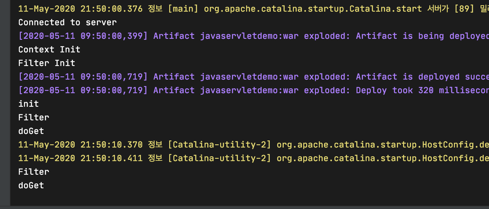

  종료시에는 서블릿 종료, 필터 종료, 리스너 종료 순서대로 종료하는 것을 확인 할 수 있다.

  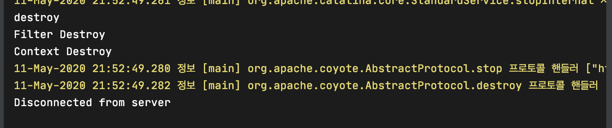