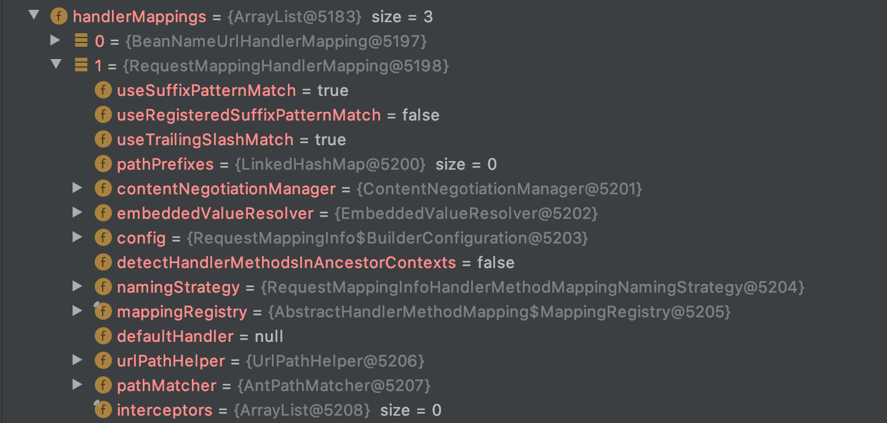
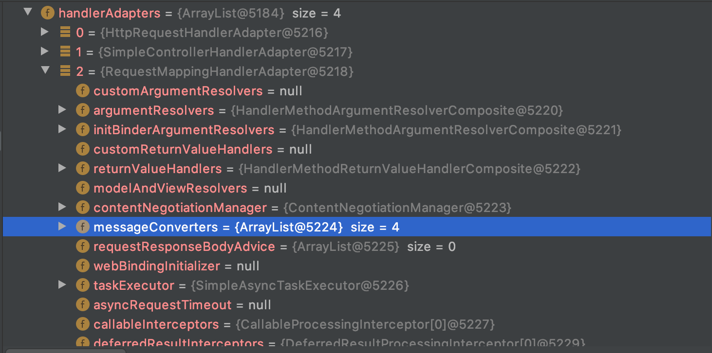
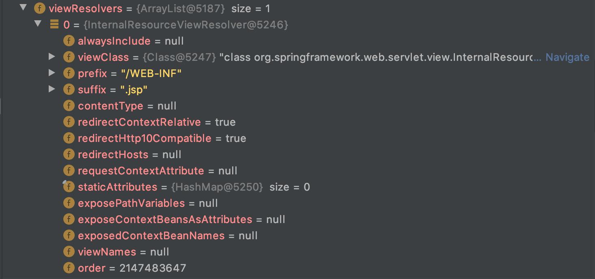
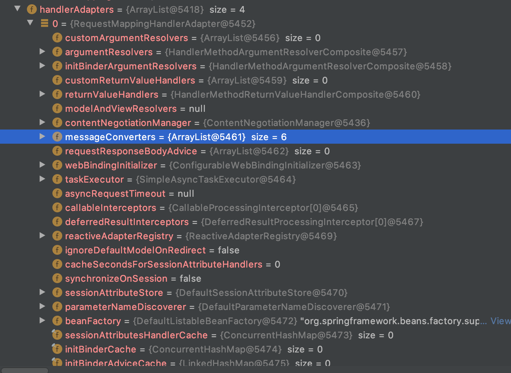
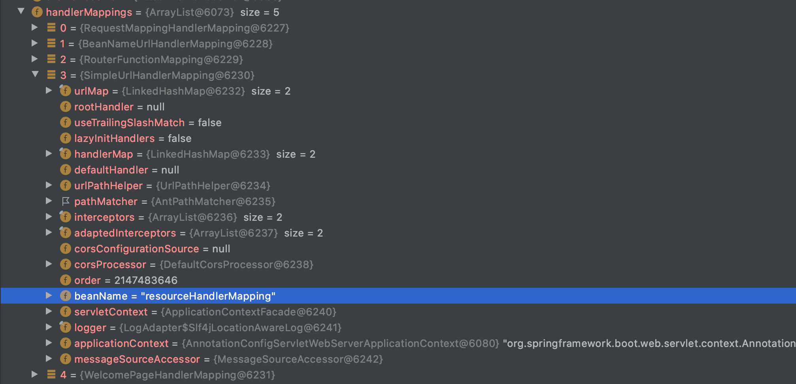
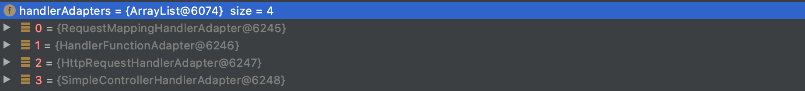
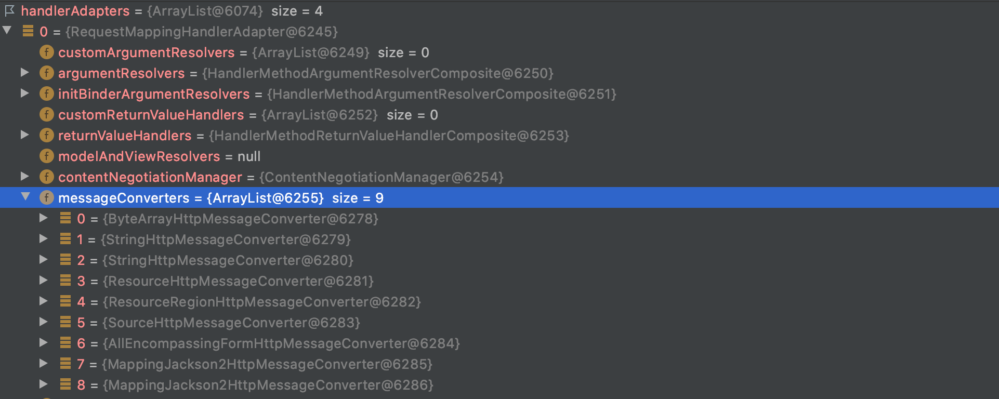

## 스프링 MVC 구성요소 등록

### 목차

1. [직접 Bean으로 등록하기](#직접-bean으로-등록하기)
2. [@EnableWebMvc 사용하여 등록하기](#@EnableWebMvc-사용하여-등록하기)
3. [Spring Boot의 Spring MVC 설정](#Spring Boot의 Spring MVC 설정)

### 직접 Bean으로 등록하기

- 스프링 MVC 구성 요소 직접 빈으로 등록하기

  @Configuration을 사용한 자바 설정 파일에 직접 @Bean을 사용해서 등록하기, @Bean으로 직접 등록할때 여러가지 설정을 할 수 있다 아래 handlerMapping에서는 setOrder() 메소드를 통해 우선순위를 변경하였다.

  ```java
  package me.jiho;
  
  import org.springframework.context.annotation.Bean;
  import org.springframework.context.annotation.ComponentScan;
  import org.springframework.context.annotation.Configuration;
  import org.springframework.core.Ordered;
  import org.springframework.stereotype.Controller;
  import org.springframework.web.servlet.HandlerMapping;
  import org.springframework.web.servlet.ViewResolver;
  import org.springframework.web.servlet.mvc.method.annotation.RequestMappingHandlerMapping;
  import org.springframework.web.servlet.view.InternalResourceViewResolver;
  
  @Configuration
  @ComponentScan
  public class WebConfig {
  
      @Bean
      public HandlerMapping handlerMapping() {
          RequestMappingHandlerMapping handlerMapping = new RequestMappingHandlerMapping();
          handlerMapping.setOrder(Ordered.HIGHEST_PRECEDENCE);
          return handlerMapping;
      }
  
      @Bean
      public ViewResolver viewResolver() {
          InternalResourceViewResolver viewResolver = new InternalResourceViewResolver();
          viewResolver.setPrefix("/WEB-INF");
          viewResolver.setSuffix(".jsp");
          return viewResolver;
      }
  }
  ```

### @EnableWebMvc 사용하여 등록하기

@EnableWebMvc annotation이 없는 경우 @Bean으로 설정한것이 들어가고 @Bean으로 설정한 것이 없으면 `DispatcherServlet.properties` 에 있는 기본 전략을 사용한다

- @EnableWebMvc를 사용하지 않은 경우

  WebConfig가 아래와 같이 @EnableWebMvc 없이 ViewResolver만 빈으로 등록할때

  ```java
  @Configuration
  @ComponentScan
  public class WebConfig {
      @Bean
      public ViewResolver viewResolver() {
          InternalResourceViewResolver viewResolver = new InternalResourceViewResolver();
          viewResolver.setPrefix("/WEB-INF");
          viewResolver.setSuffix(".jsp");
          return viewResolver;
      }
  }
  ```

  handlerMappings의 interceptors가 0개이고, handlerAdapters의 messageConverters가 4개가 등록된것을 확인할 수 있다

  

  

  

- @EnableWebMvc를 사용한 경우

  먼저 WebApplication 클래스에 가서 ApplicationContext에 ServletContext를 설정해 주어야 한다

  ```java
  public class WebApplication implements WebApplicationInitializer {
      @Override
      public void onStartup(ServletContext servletContext) throws ServletException {
          AnnotationConfigWebApplicationContext context = new AnnotationConfigWebApplicationContext();
          context.setServletContext(servletContext);
          context.register(WebConfig.class);
          context.refresh();
  
          DispatcherServlet dispatcherServlet = new DispatcherServlet(context);
          ServletRegistration.Dynamic app = servletContext.addServlet("app", dispatcherServlet);
          app.addMapping("/app/*");
      }
  }
  ```

  그다음 WebConfig 클래스에 @EnableWebMvc annotation을 붙여준다

  ```java
  @Configuration
  @ComponentScan
  @EnableWebMvc
  public class WebConfig {
      @Bean
      public ViewResolver viewResolver() {
          InternalResourceViewResolver viewResolver = new InternalResourceViewResolver();
          viewResolver.setPrefix("/WEB-INF");
          viewResolver.setSuffix(".jsp");
          return viewResolver;
      }
  }
  ```

  handlerMappings에 RequestMappingHandlerMapping의 order가 0으로 바뀌고 2개의 interceptors가 추가된것을 확인할 수 있다

  

  handlerAdapters의 RequestMappingHandlerAdapter의 경우도 messageConverters가 4개에서 6개로 늘어난 것을 확인할 수 있다

  

- DelegatingWebMvcConfiguration

  @EnableWebMvc annotation을 확인해보면 @EnableWebMvc는  DelegatingWebMvcConfiguration을 포함하는 것을 알 수 있다

  ```java
  @Retention(RetentionPolicy.RUNTIME)
  @Target(ElementType.TYPE)
  @Documented
  @Import(DelegatingWebMvcConfiguration.class)
  public @interface EnableWebMvc {
  }
  ```

  DelegatingWebMvcConfiguration 클래스를 확인하면 빈 등록을 다른 클래스로 위임해서 빈을 등록하는 것을 확인 할 수 있는데 이를 통해 확장을 쉽게 할 수 있다

  ```java
  @Configuration(proxyBeanMethods = false)
  public class DelegatingWebMvcConfiguration extends WebMvcConfigurationSupport {
  
  //..
  
  	@Override
  	protected void addFormatters(FormatterRegistry registry) {
  		this.configurers.addFormatters(registry);
  	}
  
  	@Override
  	protected void addInterceptors(InterceptorRegistry registry) {
  		this.configurers.addInterceptors(registry);
  	}
  
  	@Override
  	protected void addResourceHandlers(ResourceHandlerRegistry registry) {
  		this.configurers.addResourceHandlers(registry);
  	}
  
  //..
  
  }
  ```

- WebMvcConfigurer 인터페이스

  delegation 패턴으로 되어 있는 DelegatingWebMvcConfiguration을 커스터마이징하기위해 구현해야할 인터페이스이다 위에서 빈으로 등록했던 ViewResolver를 configureViewResolvers() 메소드를 이용해 간단하게 구현할 수 있다

  ```java
  @Configuration
  @ComponentScan
  @EnableWebMvc
  public class WebConfig implements WebMvcConfigurer {
      @Override
      public void configureViewResolvers(ViewResolverRegistry registry) {
          registry.jsp("/WEB-INF", ".jsp");
      }
  }
  ```

### Spring Boot의 Spring MVC 설정

- HandlerMappings

  스프링부트의 handlerMapping은 5개가 등록되어 있는데 그중 SimpleUrlHandlerMapping의 ResourceHandlerMapping은 resources의 정적 reource를 효율적으로 제공한다

  

- HandlerAdapter

  핸들러어뎁터는 4개가 등록되어 있다

  

  

- ViewResolver

  ViewResolver는 5개가 등록되어 있는데 ContentNegotiatingViewResolver와 4개의 다른 ViewResolver가 있다 다른 4개의 ViewResolver는 요청에 따라 ContentNegotiatingViewResolver가 Delegation하여 사용한다

  

- 설정 정보 위치

  spring-boot-autoconfigure의 spring.factories에는 여러가지 설정 파일 등이 지정되어 있는데 이중 DispatcherServletAutoConfiguration와 WebMvcAutoConfiguration 클래스에 따라 설정된다 이중 WebMvcAutoConfiguration @ConditionalOnMissingBean(WebMvcConfigurationSupport.class) annotation이 붙어 있는데 이는 WebMvcConfigurationSupport 타입이 없는 경우에만 WebMvcAutoConfiguration을 사용하게 되어있다 WebMvcConfigurationSupport 클래스는 @EnableWebMvc가 포함하고 있는 DelegatingWebMvcConfiguration이 상속하고 있는 클래스이다

  ```java
  @Configuration(proxyBeanMethods = false)
  @ConditionalOnWebApplication(type = Type.SERVLET)
  @ConditionalOnClass({ Servlet.class, DispatcherServlet.class, WebMvcConfigurer.class })
  @ConditionalOnMissingBean(WebMvcConfigurationSupport.class)
  @AutoConfigureOrder(Ordered.HIGHEST_PRECEDENCE + 10)
  @AutoConfigureAfter({ DispatcherServletAutoConfiguration.class, TaskExecutionAutoConfiguration.class,
  		ValidationAutoConfiguration.class })
  public class WebMvcAutoConfiguration {
  	//...
  }
  ```

- 스프링 부트에서 스프링 MVC 커스터마이징

  - @Configuration + implements WebMvcConfigurer

    @Configuration을 이용해 설정 파일로 지정하고 WebMvcConfigurer를 구현해 추가적으로 설정을 할 수 있다

  - @Configuration + @EnableWebMvc + implements WebMvcConfigurer

    @EnableWebMvc annotation을 사용하면 WebMvcAutoConfiguration이 사용되지 않으므로 스프링 부트의 기본 설정을 사용하지 않을 수 있다

  - `application.properties`

    WebMvcAutoConfiguration은 ResourceProperties, WebMvcProperties 등의 클래스에 따라 설정을 한다

    ```java
    @Configuration(proxyBeanMethods = false)
    	@Import(EnableWebMvcConfiguration.class)
    	@EnableConfigurationProperties({ WebMvcProperties.class, ResourceProperties.class })
    	@Order(0)
    	public static class WebMvcAutoConfigurationAdapter implements WebMvcConfigurer {
    
    		private static final Log logger = LogFactory.getLog(WebMvcConfigurer.class);
    
    		private final ResourceProperties resourceProperties;
    
    		private final WebMvcProperties mvcProperties;
    
    		private final ListableBeanFactory beanFactory;
    
    		private final ObjectProvider<HttpMessageConverters> messageConvertersProvider;
    
    		final ResourceHandlerRegistrationCustomizer resourceHandlerRegistrationCustomizer;
    //...
    }
    ```

    Properties 클래스를 보면 prefix가 붙어있는 것을 확인할 수 있는데 application.properties에서 이 prefix에 해당하는 값을 커스터마이징 할 수 있다

    ```java
    @ConfigurationProperties(prefix = "spring.resources", ignoreUnknownFields = false)
    public class ResourceProperties {
    	//...
    }
    ```