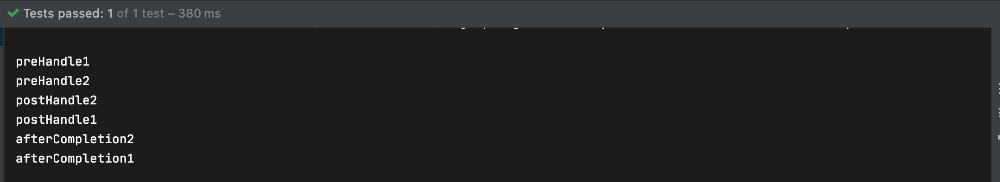

## HandlerIntercepter

### HandlerIntercepter 소개

- HandlerInterceptor

  - HandlerMapping에 설정할 수 있는 인터셉터로 핸들러를 실행하기 전,후, 완료 시점에 부가 작업을 하고 싶은 경우 사용
  - 여러 핸들러에서 반복적으로 사용하는 코드를 줄일 때 사용

- HandlerInterceptor의 메소드

  - boolean preHandle(request, response, handler)

    핸들러가 실행되기 전에 호출되고

    핸들러에 대한 정보를 사용할 수 있기 때문에 서블릿필터에 비해 세밀한 로직을 구현할 수 있다

    리턴 값으로 핸들러로 요청, 응답을 전달할지, 응답 처리를 이곳에서 끝났는지 알린다

  - void postHandle(request, response, handler, modelAndView)

    핸들러 실행기 끝나고 뷰를 랜더링 하기 전에 호출

    뷰에 전달할 추가적 또는 여러 핸들러에 공통적으로 사용될 모델 정보를 담는데 사용할 수 있다

    핸들러 인터셉터가 여러개 일때 인터셉터의 역순으로 호출된다

    비동기적인 요청 처리 시에는 호출되지 않는다

  - void afterCompletion(request, response, handler, ex)

    요청 처리가 완전히 끝난 뒤(뷰 랜더링 끝난 뒤)에 호출

    preHandler에서 true를 리턴한 경우에만 호출 된다

    이 메소드는 인터셉터 역순으로 호출된다.

    비동기적인 요청 처리 시에는 호출되지 않는다.

- 서블릿 필터와 차이

  핸들러 정보와, modelAndView를 제공하기 때문에 서블릿보다 구체적은 처리가 가능하다

  서블릿은 보다 일반적인 용도의 기능을 구현하는데 사용하는 것이 좋다

### HandlerInterceptor 적용하기

- HandlerInterceptor 구현

  HandlerInterceptor 인터페이스를 구현하여 GreetingInterceptor과 AnotherInterceptor 클래스를 만든다

  ```java
  import org.springframework.web.servlet.HandlerInterceptor;
  import org.springframework.web.servlet.ModelAndView;
  
  import javax.servlet.http.HttpServletRequest;
  import javax.servlet.http.HttpServletResponse;
  
  public class GreetingInterceptor implements HandlerInterceptor {
      @Override
      public boolean preHandle(HttpServletRequest request, 
  						HttpServletResponse response, Object handler) throws Exception {
          System.out.println("preHandle1");
          return true;
      }
  
      @Override
      public void postHandle(HttpServletRequest request, 
  										HttpServletResponse response, 
  								Object handler, ModelAndView modelAndView) throws Exception {
          System.out.println("postHandle1");
      }
  
      @Override
      public void afterCompletion(HttpServletRequest request, HttpServletResponse response, Object handler, Exception ex) throws Exception {
          System.out.println("afterCompletion1");
      }
  }
  ```

  ```java
  import org.springframework.web.servlet.HandlerInterceptor;
  import org.springframework.web.servlet.ModelAndView;
  
  import javax.servlet.http.HttpServletRequest;
  import javax.servlet.http.HttpServletResponse;
  
  public class AnotherInterceptor implements HandlerInterceptor {
      @Override
      public boolean preHandle(HttpServletRequest request, HttpServletResponse response, Object handler) throws Exception {
          System.out.println("preHandle2");
          return true;
      }
  
      @Override
      public void postHandle(HttpServletRequest request, HttpServletResponse response, Object handler, ModelAndView modelAndView) throws Exception {
          System.out.println("postHandle2");
      }
  
      @Override
      public void afterCompletion(HttpServletRequest request, HttpServletResponse response, Object handler, Exception ex) throws Exception {
          System.out.println("afterCompletion2");
      }
  ```

- HandlerInterceptor 등록하기

  인터셉터를 addInterceptors() 메소드를 이용해 등록시킨다. 이때 따로 Order를 설정하지 않으면 등록한 순서대로 Order가 설정된다

  ```java
  import org.springframework.context.annotation.Configuration;
  import org.springframework.format.FormatterRegistry;
  import org.springframework.web.servlet.config.annotation.InterceptorRegistry;
  import org.springframework.web.servlet.config.annotation.WebMvcConfigurer;
  
  @Configuration
  public class WebConfig implements WebMvcConfigurer {
      @Override
      public void addInterceptors(InterceptorRegistry registry) {
          registry.addInterceptor(new GreetingInterceptor());
          registry.addInterceptor(new AnotherInterceptor());
      }
  }
  ```

  실행 시키면 postHandle과 afterCompletion이 역순으로 출력되는 것을 확인 할 수 있다.

  

  order를 이용해 순서를 지정하거나 addPathPatterns() 메소드를 이용해 특정 path에만 적용할 수 있다

  ```java
  @Configuration
  public class WebConfig implements WebMvcConfigurer {
      @Override
      public void addInterceptors(InterceptorRegistry registry) {
          registry.addInterceptor(new GreetingInterceptor()).order(-1);
          registry.addInterceptor(new AnotherInterceptor())
                  .addPathPatterns("/hi")
                  .order(0);
      }
  }
  ```