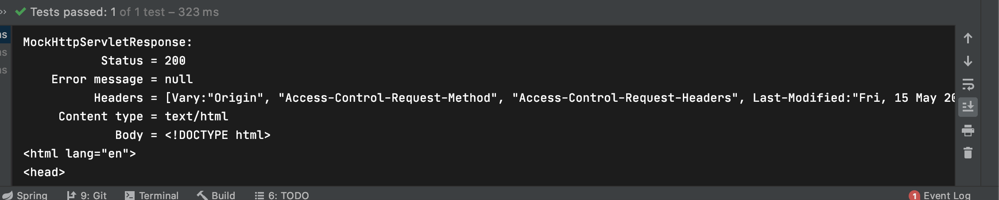

## Resource Handler

### ResourceHandler 소개

- Resource Handler

  이미지, 자바스크립트, css, HTML 파일과 같은 정적인 리소스를 처리하는 핸들러

- Default Servlet

  서블릿 컨테이너에서 기본적으로 제공하는 정적인 리소스 처리 서블릿

- Spring MVC 리소스 핸들러 매핑 등록

  스프링 MVC에서는 정적인 리소르 처리를 DefaultServlet에 위임하여 처리한다

  가장 낮은 우선 순위로 등록하여 다른 핸들러 매핑이 처리하도록하고 마지막으로 리소스 핸들러가 처리한다

- 스프링부트 리소스 핸들러 매핑

  기본 정적 리소스 핸들러와 캐싱을 지원한다

  resouraces/static 폴더 안에 정적인 리소스를 넣으면 매핑시켜준다

- Resource Handler 설정

  - 요청 패턴 지정
  - 리소스 위치 : 여러개 지정가능
  - 캐싱 설정
  - ResourceResolver : 요청에 해당하는 리소스를 찾는 전략
  - ResourceTransformer : 응답으로 보낼 리소스를 수정하는 전략

  WebMvcConfigurer를 구현한 클래스에 addResourceHandlers() 메소드를 이용해 Resource Handler를 추가적으로 등록할 수 있다

  ```java
  @Configuration
  public class WebConfig implements WebMvcConfigurer {
  
      @Override
      public void addResourceHandlers(ResourceHandlerRegistry registry) {
      }
  }
  ```

### Resource Handler 적용하기

- Resource Handler 구현

  resources폴더에 mobile이라는 폴더를 만들고 index.html을 만들어준다

  ```html
  <!DOCTYPE html>
  <html lang="en">
  <head>
      <meta charset="UTF-8">
      <title>Title</title>
  </head>
  <body>
  <h1>hello mobile</h1>
  </body>
  </html>
  ```

  addResourceHandler안에 매핑될 url을 설정하고 addResourceLocations안에 정적리소스 파일의 경로를 지정하고 setCacheControl을 이용해 캐싱을 설정 할 수 있다

  ```java
  @Configuration
  public class WebConfig implements WebMvcConfigurer {
  
      @Override
      public void addResourceHandlers(ResourceHandlerRegistry registry) {
          registry.addResourceHandler("/mobile/**")
                  .addResourceLocations("classpath:/mobile/")
                  .setCacheControl(CacheControl.maxAge(10, TimeUnit.MINUTES));
      }
  ```

  Test에서 캐싱설정과 내용을 확인결과 이상이 없다

  ```java
  @ExtendWith(SpringExtension.class)
  @SpringBootTest
  @AutoConfigureMockMvc
  class SampleControllerTest {
  
      @Autowired
      MockMvc mockMvc;
  
      @Test
      public void mobileStatic() throws Exception {
          this.mockMvc.perform(get("/mobile/index.html"))
                  .andDo(print())
                  .andExpect(status().isOk())
                  .andExpect(content().string(Matchers.containsString("hello mobile")))
                  .andExpect(header().exists(HttpHeaders.CACHE_CONTROL));
      }
  }
  ```

  

  그 외의 옵션들

  ```java
  @Override
      public void addResourceHandlers(ResourceHandlerRegistry registry) {
          registry.addResourceHandler("/mobile/**")
                  .addResourceLocations("classpath:/mobile/")
                  .resourceChain(true)
                  .addResolver()//어떤 요청에 해당하는 리소스를 찾는 방법
                  .addTransformer();//응답으로 내보낼 리소스를 변경하는 방법
      }
  ```

