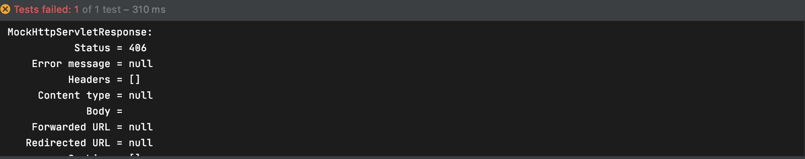

## 컨텐츠 타입 맵핑

### @RequestMapping(consumes=)

특정한 타입의 데이터를 담고 있는 요청만 처리하는 핸들러를 만들 때 consumes를 사용한다

Content-Type 헤더로 필터링한다

매치 되지 않는 경우 415 Not Supperted Media Type

```java
import org.springframework.http.MediaType;
import org.springframework.stereotype.Controller;
import org.springframework.web.bind.annotation.GetMapping;
import org.springframework.web.bind.annotation.RequestMapping;
import org.springframework.web.bind.annotation.RequestMethod;
import org.springframework.web.bind.annotation.ResponseBody;

@Controller
public class SampleController {

    @RequestMapping(value = "/hello", consumes = MediaType.APPLICATION_JSON_VALUE)
			 // "application/json"으로 작성해도 됨
    @ResponseBody // 없으면 이름에 해당하는 뷰로 돌아간다, 있으면 문자열을 응답으로 보냄
    public String hello() {
        return "hello";
    }

}
```

테스트에서 ContentType을 application/json으로 바꾸면 잘동작하는것을 확인할 수 있다

```java
@ExtendWith(SpringExtension.class)
@WebMvcTest //mock을 주입해준다
class SampleControllerTest {

    @Autowired
    MockMvc mockMvc;

    @Test
    public void helloTest() throws Exception{
        mockMvc.perform(get("/hello")
                    .contentType(MediaType.APPLICATION_JSON))
                .andDo(print())
                .andExpect(status().isOk())
                .andExpect(content().string("hello"));
    }
}
```

### @RequestMapping(produces=)

- Accept 헤더가 설정되어 Request가 특정 타입의 응답을 원하는경우 produces를 설정해 특정 타입의 응답을 필터링할 수 있다
- Accept 헤더가 설정되어 있지 않는 Request의 경우 필터링이 되지 않는다
- 매치 되지 않는 경우 406 Not Supported가 응답된다
- 클래스의 @RequestMapping annotation에도 produces가 설정되고 메소드에도 produces가 설정된 경우 메소드의 produces만 적용된다

```java
@Controller
public class SampleController {

    @RequestMapping(value = "/hello",
                    consumes = MediaType.APPLICATION_JSON_VALUE,
                    produces = MediaType.TEXT_PLAIN_VALUE
    ) // "application/json"으로 작성해도 됨
    @ResponseBody // 없으면 이름에 해당하는 뷰로 돌아간다, 있으면 문자열을 응답으로 보냄
    public String hello() {
        return "hello";
    }

}
```

핸들러가 "text/plain"로 응답한다고 설정하고 test에서는 accept 헤더로 "application/json"으로 설정하였다

```java
@ExtendWith(SpringExtension.class)
@WebMvcTest //mock을 주입해준다
class SampleControllerTest {

    @Autowired
    MockMvc mockMvc;

    @Test
    public void helloTest() throws Exception{
        mockMvc.perform(get("/hello")
                    .contentType(MediaType.APPLICATION_JSON)
                    .accept(MediaType.APPLICATION_JSON))
                .andDo(print())
                .andExpect(status().isOk())
                .andExpect(content().string("hello"));
    }
}
```

