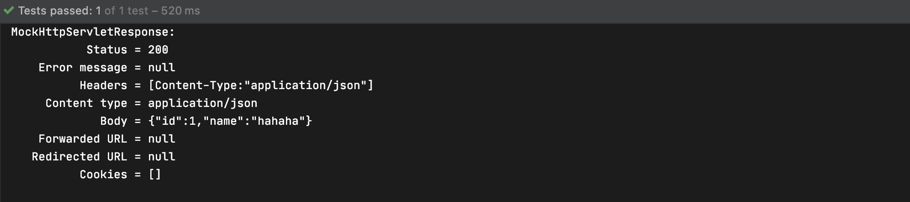
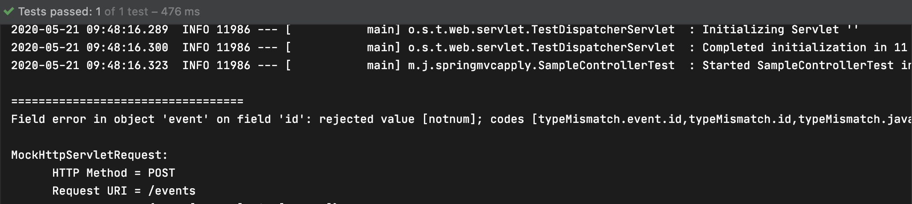
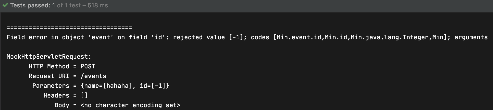

## @ModelAttribute

### @ModelAttribute

- 여러 개의 단순 타입 데이터를 복합 타입 객체로 받아오거나 해당 객체를 새로 만들 때 사용
- URI path, 요청 매개변수, 세션 등 여러 곳에서 데이터를 받아 올  수 있다
- 생략 가능하다

```java
import org.springframework.http.HttpMethod;
import org.springframework.stereotype.Controller;
import org.springframework.ui.Model;
import org.springframework.web.bind.annotation.*;

import javax.servlet.http.PushBuilder;
import java.util.Map;

@Controller
public class SampleController {

    @PostMapping("/events")
    @ResponseBody
    public Event events(@ModelAttribute Event event) {
        return event;
    }
}
```

```java
@ExtendWith(SpringExtension.class)
@WebMvcTest //mock을 주입해준다
class SampleControllerTest {

    @Autowired
    MockMvc mockMvc;

    @Test
    public void eventsTest() throws Exception{
        mockMvc.perform(post("/events?name=hahaha&id=1"))
                .andDo(print())
                .andExpect(status().isOk())
                .andExpect(jsonPath("name").value("hahaha"))
                .andExpect(jsonPath("id").value("1"));
    }
}
```



- 값을 바인딩 할 수 없는 경우

  Integer값에 문자열을 넣는 경우, BindException이 발생하여 400 에러를 출력

- 바인딩 에러를 직접 처리하고 싶은 경우

  BindingResult 타입의 아규먼트를 복합 타입 객체 오른쪽에 추가한다

  ```java
  @Controller
  public class SampleController {
      @PostMapping("/events")
      @ResponseBody
      public Event events(@ModelAttribute Event event, BindingResult bindingResult) {
          if (bindingResult.hasErrors()) {
              System.out.println("==================================");
              bindingResult.getAllErrors().forEach(c -> {
                  System.out.println(c.toString());
              });
          }
          return event;
      }
  }
  ```

  ```java
  @ExtendWith(SpringExtension.class)
  @WebMvcTest //mock을 주입해준다
  class SampleControllerTest {
  
      @Autowired
      MockMvc mockMvc;
  
      @Test
      public void eventsTest() throws Exception{
          mockMvc.perform(post("/events?name=hahaha&id=notnum"))
                  .andDo(print())
                  .andExpect(status().isOk())
                  .andExpect(jsonPath("name").value("hahaha"));
      }
  }
  ```

  

- 바인딩 이후에 검증 작업을 추가로 하고 싶은 경우

  @Valid 또는 @Validated annotation을 사용한다

  ```java
  import org.springframework.http.HttpMethod;
  import org.springframework.stereotype.Controller;
  import org.springframework.ui.Model;
  import org.springframework.validation.BindingResult;
  import org.springframework.validation.annotation.Validated;
  import org.springframework.web.bind.annotation.*;
  
  import javax.servlet.http.PushBuilder;
  import javax.validation.Valid;
  import java.util.Map;
  
  @Controller
  public class SampleController {
  
      @PostMapping("/events")
      @ResponseBody
      public Event events(@Valid @ModelAttribute Event event, BindingResult bindingResult) {
          if (bindingResult.hasErrors()) {
              System.out.println("==================================");
              bindingResult.getAllErrors().forEach(c -> {
                  System.out.println(c.toString());
              });
          }
          return event;
      }
  }
  ```

  Event 클래스에 @Min  annotation을 이용해 최솟값을 설정한다

  ```java
  import javax.validation.constraints.Min;
  
  public class Event {
  
      @Min(0)
      private Integer id;
      private String name;
  
      public Integer getId() {
          return id;
      }
  
      public void setId(Integer id) {
          this.id = id;
      }
  
      public String getName() {
          return name;
      }
  
      public void setName(String name) {
          this.name = name;
      }
  }
  ```

  ```java
  @Test
      public void eventsTest() throws Exception{
          mockMvc.perform(post("/events?name=hahaha&id=-1"))
                  .andDo(print())
                  .andExpect(status().isOk())
                  .andExpect(jsonPath("name").value("hahaha"));
      }
  ```

  BindingResult에서 에러가 발생한 것을 확인 할 수 있다

  