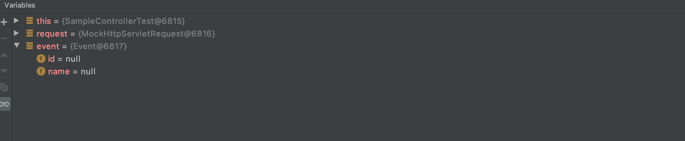

## @SessionAttributes

### @SessionAttributes

- 모델 정보를 HTTP 세션에 저장해주는 annotation
- @SessionAttributes annotation에 설정한 이름에 해당하는 모델 정보를 자동으로 세션에 넣어준다
- @ModelAttribute는 세션에 있는 데이터도 바인딩한다
- 여러 요청에서 사용해야 하는 객체를 공유할 때 사용한다
- SessionStatus를 아규먼트로 받아 세션 처리가 끝난 경우 세션을 비울수 있다

#### HTTPSession을 이용해 직접 SessionAttributes에 넣는 경우

```java
@Controller
public class SampleController {

    @GetMapping("/events/form")
    public String evnetsForm(Model model, HttpSession httpSession) {
        Event event = new Event();
        model.addAttribute("event", event);
        httpSession.setAttribute("event", event);
        return "events/form";
    }
}
```

```java
@Test
    public void eventForm() throws Exception {
        MockHttpServletRequest request = mockMvc.perform(get("/events/form"))
                .andDo(print())
                .andExpect(view().name("events/form"))
                .andExpect(model().attributeExists("event"))
                .andExpect(request().sessionAttribute("event", notNullValue()))
                .andReturn().getRequest();

        Object event = request.getSession().getAttribute("event");

        System.out.println(event);
    }
```



#### @SessionAttributes를 이용하는 경우

model에 Attribute를 추가할 때 "event"인 키를 감지하고 SessionAttribute에 넣어준다

```java
@Controller
@SessionAttributes("event")
public class SampleController {

    @GetMapping("/events/form")
    public String evnetsForm(Model model) {
        Event event = new Event();
        model.addAttribute("event", event);
        return "events/form";
    }
}
```

#### `@SesstionStatus`

`setComplete()` 메소드를 이용해 세션을 비울수 있다

```java
@GetMapping("/events/form")
    public String evnetsForm(Model model, SessionStatus status) {
        Event event = new Event();
        model.addAttribute("event", event);
        
        status.setComplete();
        return "events/form";
    }
```

### 멀티 폼 서브밋

세션을 사용해서 여러 봄에 걸쳐 데이터를 나눠 입력받고 저장하기

- @SessionAttributes 추가하기

  컨트롤러에 SessionAttributes를 추가한다

  ```java
  @Controller
  @SessionAttributes("events")
  public class SampleController {
  	//...
  }
  ```

- 이벤트 이름 입력받기

  컨트롤러에 "/events/form/name" URI를 매핑하는 핸들러를 만든다

  ```java
  @Controller
  @SessionAttributes("events")
  public class SampleController {
  
      @GetMapping("/events/form/name")
      public String evnetsForm(Model model) {
          Event event = new Event();
          model.addAttribute("event", new Event());
          return "/events/form-name";
      }
  ```

  리턴 값에 해당하는 이름의 뷰를 만든다 Create를 누르면 해당 값을 "/events/form/name" 으로 POST 요청을 보낸다

  ```html
  <!DOCTYPE html>
  <html lang="en" xmlns:th="<http://www.thymeleaf.org>">
  <head>
      <meta charset="UTF-8">
      <title>Creat New Event</title>
  </head>
  <body>
  <form action="#" th:action="@{/events/form/name}" method="post" th:object="${event}">
      <p th:if="${#fields.hasErrors('name')}" th:errors="*{name}">Incorrect data</p>
      Name: <input type="text" title="name" th:field=" *{name}">
      <input type="submit" value="Create">
  </form>
  </body>
  </html>
  ```

  @PostMapping annotation으로 "/events/form/name" URI에 맵핑되는 핸들러를 만든다 이때 event 객체에는 SessionAttributes에 있는 event 객체를 가져와 이름이 설정되어 있다 Binding한 값에 문제가 없으면 redirect로 "/event/form/limit"으로 보낸다

  ```java
  @Controller
  @SessionAttributes("event")
  public class SampleController {
  
  		@GetMapping("/events/form/name")
      public String evnetsFormName(Model model) {
          model.addAttribute("event", new Event());
          return "/events/form-name";
      }
  
      @PostMapping("/events/form/name")
      public String eventsFOrmNameSubmit(@Validated @ModelAttribute Event event,
                                         BindingResult bindingResult) {
          if (bindingResult.hasErrors()) {
              return "/events/form-name";
          }
          return "redirect:/events/form/limit";
      }
  }
  ```

- 이벤트 제한 인원 입력받기

  "events/form/limit" URI를 처리하는 핸들러를 만든다 @ModelAttribute를 이용해 event 객체에 SessionAttribute의 정보를 입력받고 뷰의 이름을 리턴해준다

  ```java
  @Controller
  @SessionAttributes("event")
  public class SampleController {
  
  		//...
  
      @GetMapping("/events/form/limit")
      public String evnetsFormLimit(@ModelAttribute Event event, Model model) {
          model.addAttribute("event", event);
          return "/events/form-limit";
      }
  
  }
  ```

  리턴 값의 이름에 해당하는 뷰를 만든다 Create를 누르면 "/events/form/limit" URI로 POST 요청을 보낸다

  ```html
  <!DOCTYPE html>
  <html lang="en" xmlns:th="<http://www.thymeleaf.org>">
  <head>
      <meta charset="UTF-8">
      <title>Creat New Event</title>
  </head>
  <body>
  <form action="#" th:action="@{/events/form/limit}" method="post" th:object="${event}">
      <p th:if="${#fields.hasErrors('limit')}" th:errors="*{limit}">Incorrect data</p>
      Limit: <input type="text" title="id" th:field="*{limit}">
      <input type="submit" value="Create">
  </form>
  </body>
  </html>
  ```

  list를 보여주기 전에 	sessionStatus.setComplete 메소드를 이용하여 SessionAttribute를 비워준다

  ```java
  @PostMapping("/events/form/limit")
      public String eventsFormLimitSubmit(@Validated @ModelAttribute Event event,
                                         BindingResult bindingResult,
                                         SessionStatus sessionStatus) {
          if (bindingResult.hasErrors()) {
              return "/events/form-limit";
          }
  				sessionStatus.setComplete();
          return "redirect:/events/list";
      }
  ```