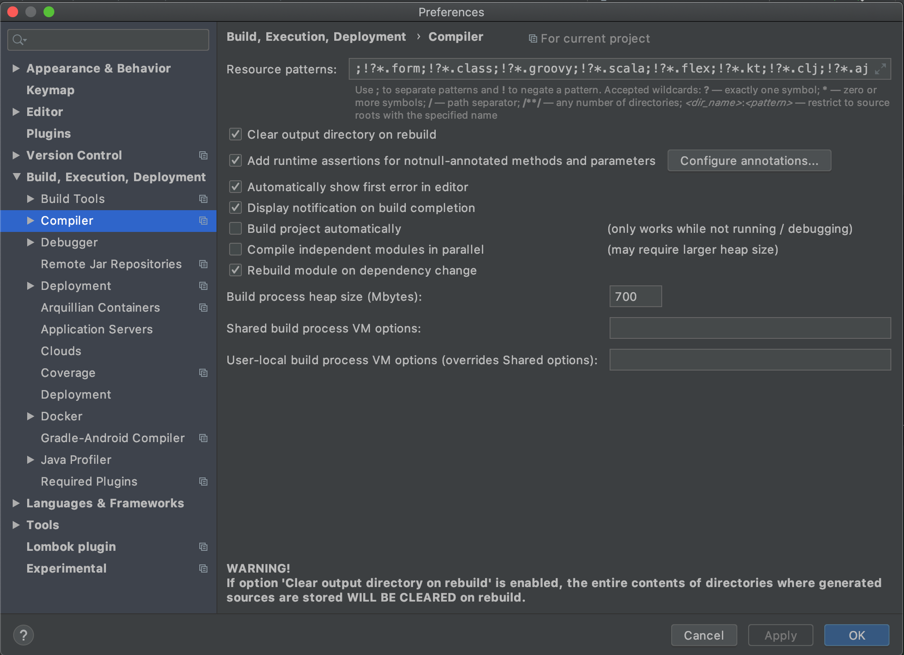
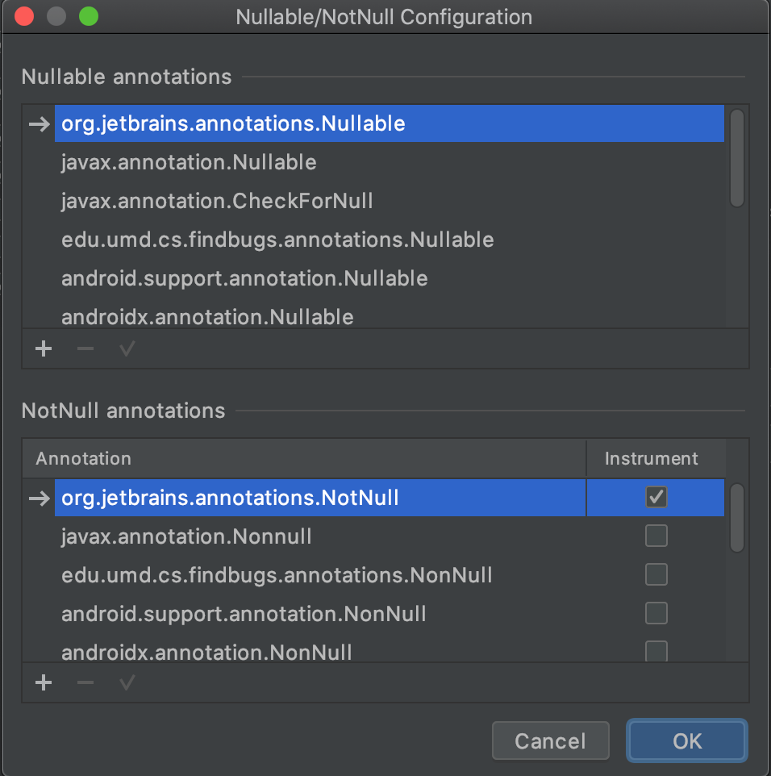

## 스프링 AOP / Null-safety

### 목차

1. [스프링 AOP](#스프링-aop)
   - [AOP 개념소개](#aop-개념소개)
   - [프록시 기반 AOP](#프록시-기반-aop)
   - [@AspectJ](#aspectj)
2. [Null-safety](#null-safety)

### 스프링 AOP

#### AOP 개념 소개

- AOP

  Aspect Oriented Programming 흩어진 Aspect를 모듈화 하는 프로그레밍 기법 어떤 로직을 기준으로 여러 관점으로 나누어서 보고 그 관점을 기준으로 각각 모듈화 하는 것을 말한다. 흩어진 관심사를 Aspect로 모듈화하고 핵심적인 비지니스 로직에서 분리하여 재사용하겠다는 것이 AOP의 목표

- AOP 주요 개면

  - Aspect: 흩어진 관심사를 모듈화 한것
  - Target: Aespect를 적용하는 곳(클래스, 메서드)
  - Advice: 실질적으로 어떤 일을 해야할지
  - JointPoint: Advice가 적용될 위치, 끼어들 수 있는 지점
  - PointCut: JointPoint의 상세, 실제 Advice가 실행해야 할 지점

- 자바의 AOP 구현체

  - AspectJ

    다양한 JoinPoint와 기능 제공

  - 스프링 AOP

    국한적인 기능 제공

- AOP를 구현하는 방법

  - 컴파일 타임

    조작이 된 바이트 코드를 생성, 별도의 컴파일을 거쳐야 한다.

    [A.java](http://a.java) → (AOP) → A.class

  - 로드 타임

    로딩 시 바이트 코드를 조작, 로딩시 약간의 부하, 별도의 설정 필요

    [A.java](http://a.java) → A.class → (AOP) → 메모리

  - 런타임

    SpringAOP가 사용하는 방법, Spring에서 빈을 만들 때 프록시 빈을 만들어 실제 실행직전에 , 빈을 만드는데 부하가 있다. 사용시에는 비용이 없다. 로드 타임과 부하가 비슷 별도의 설정 필요 없음

#### 프록시 기반 AOP

- 스프링 AOP 특징

  - 프록시 기반의 AOP 구현체
  - 스프링 빈에만 AOP를 적용할 수 있다.
  - 모든 AOP 기능을 제공하는 것이 목적이 아니라, 스프링

- 프록시 패턴

  기존 코드 변경 없이 접근 제어 또는 부가 기능 추가

  - 문제점 매번 프록시 클래스 작성
  - 여러 메소드에 적용하려면 불편하다

- 스프링 AOP

  기존 빈을 대체하는 동적 프록시 빈을 만들어 등록시켜준다.   BeanPostProcessor을 구현한 AbstractAutoProxyCreator를 사용한다.

#### @AspectJ

- 의존성 추가

  스프링 @AspectJ를 사용하기 위해서는 의존성을 추가해주어야 한다.

  ```xml
  <dependency> 
  	<groupId>org.springframework.boot</groupId> 
  	<artifactId>spring-boot-starter-aop</artifactId>
  </dependency>
  ```

- @Aspect annotation으로 AOP 구현체 만들기

  @Component로 빈으로 등록하고 @Aspect로 Aspect인 것을 알려준다. @Around()를 통해 적용될 대상을 설정한다.

  ```java
  import org.aspectj.lang.ProceedingJoinPoint;
  import org.aspectj.lang.annotation.Around;
  import org.aspectj.lang.annotation.Aspect;
  import org.springframework.stereotype.Component;
  
  @Component
  @Aspect
  public class PerfAspect {
      //advice가 제공되는 대상
      @Around("execution(* me.jiho..*.EventService.*(..))")//메서드를 감싸는 형태
      public Object logPerf(ProceedingJoinPoint pjp) throws Throwable {
          long begin = System.currentTimeMillis();
          Object retVal = pjp.proceed();
          System.out.println(System.currentTimeMillis() - begin);
          return retVal;
      }
  }
  ```

  ```java
  package me.jiho.springdemo;
  
  public interface EventService {
      void creatEvent();
  
      void publishEvnet();
  }
  ```

  ```java
  package me.jiho.springdemo;
  
  import org.springframework.stereotype.Service;
  
  @Service
  public class SimpleEventService implements EventService {
      @Override
      public void creatEvent() {
          try {
              Thread.sleep(1000);
          } catch (InterruptedException e) {
              e.printStackTrace();
          }
          System.out.println("Created an event");
      }
  
      @Override
      public void publishEvnet() {
          try {
              Thread.sleep(2000);
          } catch (InterruptedException e) {
              e.printStackTrace();
          }
          System.out.println("Published an event");
      }
  }
  ```

  ```java
  package me.jiho.springdemo;
  
  import org.springframework.beans.factory.annotation.Autowired;
  import org.springframework.boot.ApplicationArguments;
  import org.springframework.boot.ApplicationRunner;
  import org.springframework.stereotype.Component;
  
  @Component
  public class AppRunner implements ApplicationRunner {
      @Autowired
      EventService eventService;
      @Override
      public void run(ApplicationArguments args) throws Exception {
          eventService.creatEvent();
          eventService.publishEvnet();
      }
  }
  ```

- 경로지정이 아닌 annotation 기반 AOP 적용

  PerLogging annotation을 만든다.

  ```java
  package me.jiho.springdemo;
  
  import java.lang.annotation.*;
  
  @Documented //javaDOc 만들때 Doc으로
  @Retention(RetentionPolicy.CLASS)
  @Target(ElementType.METHOD)
  //annotation 정보를 언제까지 유지 할 것인가 기본은 class source로 하면 컴파일 하면 사라진다
  public @interface PerLogging {
  }
  ```

  Aspect에 @Around에 annotation기반으로 정보를 넣는다. @PerLogging이 붙어 있으면 적용된다.

  ```java
  package me.jiho.springdemo;
  
  import org.aspectj.lang.ProceedingJoinPoint;
  import org.aspectj.lang.annotation.Around;
  import org.aspectj.lang.annotation.Aspect;
  import org.springframework.stereotype.Component;
  
  @Component
  @Aspect
  public class PerfAspect {
      //advice가 제공되는 대
      @Around("@annotation(PerLogging)")//PerLogging annotation이 달려 있는곳에 적용
      public Object logPerf(ProceedingJoinPoint pjp) throws Throwable {
          long begin = System.currentTimeMillis();
          Object retVal = pjp.proceed();
          System.out.println(System.currentTimeMillis() - begin);
          return retVal;
      }
  }
  ```

- Bean을 기반으로 모든 메서드에 적용

  ```java
  package me.jiho.springdemo;
  
  import org.aspectj.lang.ProceedingJoinPoint;
  import org.aspectj.lang.annotation.Around;
  import org.aspectj.lang.annotation.Aspect;
  import org.springframework.stereotype.Component;
  
  @Component
  @Aspect
  public class PerfAspect {
      //advice가 제공되는 대
      @Around("bean(simpleEventService)")//PerLogging annotation이 달려 있는곳에 적용
      public Object logPerf(ProceedingJoinPoint pjp) throws Throwable {
          long begin = System.currentTimeMillis();
          Object retVal = pjp.proceed();
          System.out.println(System.currentTimeMillis() - begin);
          return retVal;
      }
  }
  ```

- 다른 advice 정의

  @Around 왜에도 다양한 annotation이 제공된다.

  - @Before (이전) : 어드바이스 타겟 메소드가 호출되기 전에 어드바이스 기능을 수행
  - @After (이후) : 타겟 메소드의 결과에 관계없이(즉 성공, 예외 관계없이) 타겟 메소드가 완료 되면 어드바이스 기능을 수행
  - @AfterReturning (정상적 반환 이후)타겟 메소드가 성공적으로 결과값을 반환 후에 어드바이스 기능을 수행
  - @AfterThrowing (예외 발생 이후) : 타겟 메소드가 수행 중 예외를 던지게 되면 어드바이스 기능을 수행
  - @Around (메소드 실행 전후) : 어드바이스가 타겟 메소드를 감싸서 타겟 메소드 호출전과 후에 어드바이스 기능을 수행

### Null-safety

- Null-safety

  스프링 프레임워크5에 추가된 Null 관련 annotation, 컴파일 타임에 최대한 NullPointerException을 방지하기 위해 제공, Null을 허용하는지 안하는지 annotation으로 마킹

  - @NonNull
  - @Nullable
  - @NonNullApi: 패키지 전체가 Null이 되지 않게
  - @NonNullField

  적용하려면 설정에 들어가서 Nullable, NotNull을 추가시켜 주어야 한다.

  

  