## DispatcherServlet

### 목차

1. [DispatcherServlet 소개](#dispatcherservlet-소개)
2. [DispatcherServlet 설정하기](#dispatcherservlet-설정하기)
3. [DispatcherServlet 동작원리](#dispatcherservlet-동작원리)
   - [@ResponseBody](#@responsebody)
   - [View가 있는 경우](#view가-있는-경우)
   - [커스텀 ViewResolver](#커스텀-viewresolver)
4. [DispatcherServlet의 구성요소](#DispatcherServlet의-구성요소)

### DispatcherServlet 소개

- Servlet의 문제점

  - url 하나당 서블릿을 하나를 만들어야한다,
  - 서블릿 하나를 추가할 때마다 web.xml 설정을 추가해 주어야한다
  - 서블릿 공통의 작업을 처리할때 불편하다

- Front Controller 패턴

  클라이언트의 다양한 요청들을 한곳으로 받아 각각의 핸들러에 분배해주는 디자인 패턴

  

- DispatcherServlet

  스프링 MVC의 핵심으로, Front Controller 역할을 해주는 서블릿 DispatcherServlet은  ContextLoaderListener에 의해 등록된 Root ApplicationContext와 Root ApplicationContext를 상속받은 Servlet ApplicationContext로 이루어져 있다.

  - 상속의 이유

    Root ApplicationContext는 다른 서블릿에서 공유해서 사용할 수 있다. Servlet ApplicationContext는 DispatcherServlet안에서만 사용가능하다. 따라서 DispatcherServlet을 여러개 사용하는 경우 서로 공유하는 빈들이 있을 수 있으므로 계층구조로 만들었다 아래 그림에서 Services와 Repository는 다른 Servlet에서 사용하지만 Controller, HandlerMapping은 해당 Servlet에서만 사용한다

    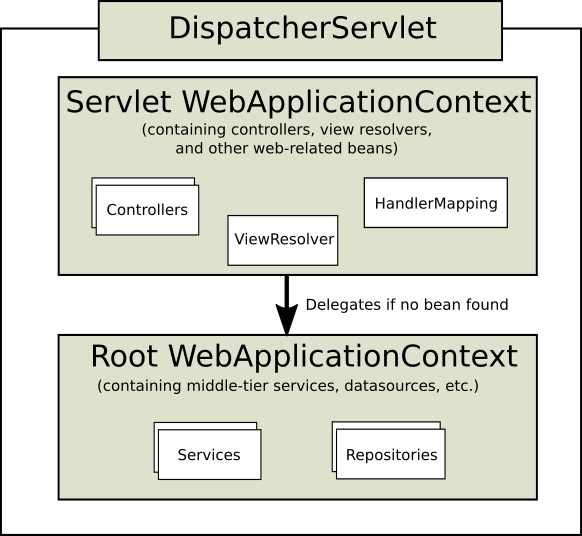

### DispatcherServlet 설정하기

- Root ApplicationContext 설정 클래스에 필터 적용

  Root ApplicationContext에서 Controller를 빈으로 등록하지 않기 위해 AppConfig에 ComponentScan시 필터를 적용한다

  ```java
  @Configuration
  @ComponentScan(excludeFilters = @ComponentScan.Filter(Controller.class))
  public class AppConfig {
  }
  ```

- Servlet ApplicationContext 설정 클래스 만들기

  Servlet ApplicationContext에 Controller만 빈으로 등록시키기 위해 WebConfig 설정 클래스를 다음과 같이 만든다.

  ```java
  import org.springframework.context.annotation.ComponentScan;
  import org.springframework.context.annotation.Configuration;
  import org.springframework.stereotype.Controller;
  
  @Configuration
  @ComponentScan(useDefaultFilters = false, includeFilters = @ComponentScan.Filter(Controller.class))
  public class WebConfig {
  }
  ```

- DispatcherServlet 등록

  web.xml에 DispatcherServelt으로 등록하고 스프링 설정 파일을 AnnotationConfigWebApplicationContext로 변경하고 WebConfig의 위치를 넣어준다.

  ```xml
  <servlet>
      <servlet-name>app</servlet-name>
      <servlet-class>org.springframework.web.servlet.DispatcherServlet</servlet-class>
      <init-param>
        <param-name>contextClass</param-name>
        <param-value>org.springframework.web.context.support.AnnotationConfigWebApplicationContext</param-value>
      </init-param>
      <init-param>
        <param-name>contextConfigLocation</param-name>
        <param-value>me.jiho.WebConfig</param-value>
      </init-param>
    </servlet>
  ```

  servlet 매핑을 이용해 app/ 으로 시작하는 모든 url을 dispatcherServlet에 매핑시킨다

  ```xml
    <servlet-mapping>
      <servlet-name>app</servlet-name>
      <url-pattern>/app/*</url-pattern>
    </servlet-mapping>
  ```

- Controller 만들기

  ```java
  import org.springframework.beans.factory.annotation.Autowired;
  import org.springframework.web.bind.annotation.GetMapping;
  import org.springframework.web.bind.annotation.RestController;
  
  @RestController
  public class HelloController {
  
      @Autowired
      HelloService helloService;
  
      @GetMapping("/hello")
      public String hello() {
          return "Hello, " + helloService.getName();
      }
  
  }
  ```

  url에 [localhost:8080/app/hello를](http://localhost:8080/app/hello를) 요청하면 다음과 같이 동작하는것을 확인 할 수 있다.

  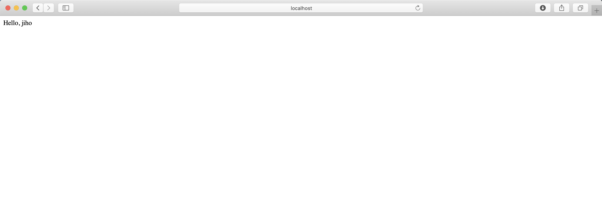

  계층구조를 원하지 않는 경우 ContextLoaderListener 없이도 사용할 수 있다. 위 방법은 서블릿 컨테이너를 실행하고 서블릿 애플리케이션에 스프링을 연동시키는 방법으로 스프링부트는 스프링부트 애플리케이션이 먼저 동작하고  그 안에 톰캣이 내장 서버로 동작한다.

### DispatcherServlet 동작원리

#### @ResponseBody

- 디버거를 이용한 동작원리 파악

  DispatcherServlet에 doService메소드 에 breakpoint를 만든다.

  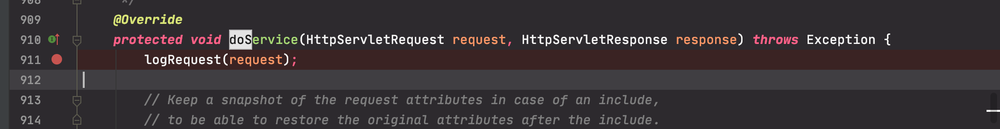

  stepover로 한줄씩 실행하다가 doDispatch 부분에서 stepinto로 해당 메소드로 이동한다 doDisptch 메소드에서 mappedHandler를 처리하는 부분이 있다

  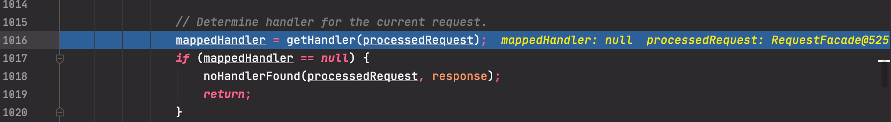

  step Into로 해당 메소드로 이동한다 밑에 변수를 살펴보면 3개의 handlerMapping이 있는것을 확인 할 수 있다 이중 RequestMappingHandlerMapping이 @GetMapping, @PostMapping 등 annotation이 붙은 handler를 찾아 주는 역할을 한다

  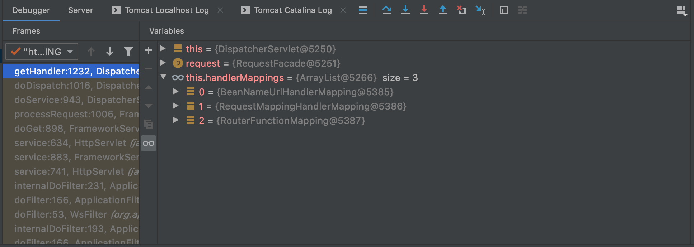

  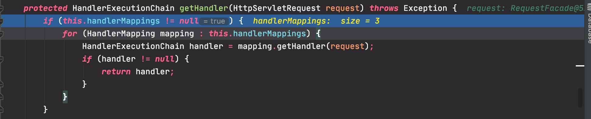

  위의 결과로  Handler를 return하게 된다 다음으로 HandlerAdapter를 처리하는 부분이 있다.

  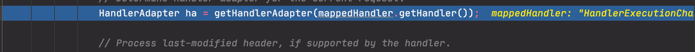

  getHandlerAdapter를 살펴보면 4개의 HandlerAdapter가 있는 것을 확인할 수 있고 이중에 RequestMappingHandlerAdapter가 선택된다

  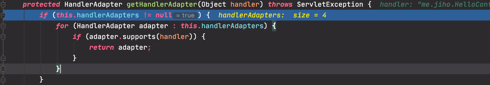

  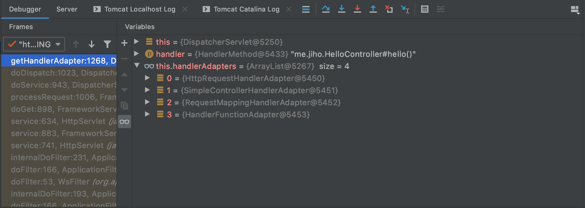

  다음은 실제 handlerAdater를 이용해 요청을 처리하는 과정이다

  

  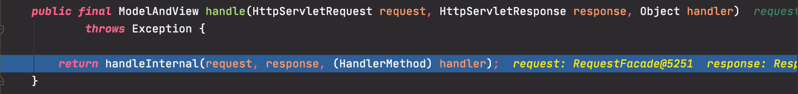

  자바의 Reflection을 이용해 handlerMethod를 호출하게된다.

  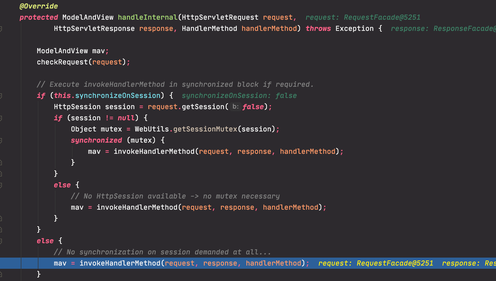

  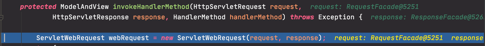

  hello()를 실행한다

  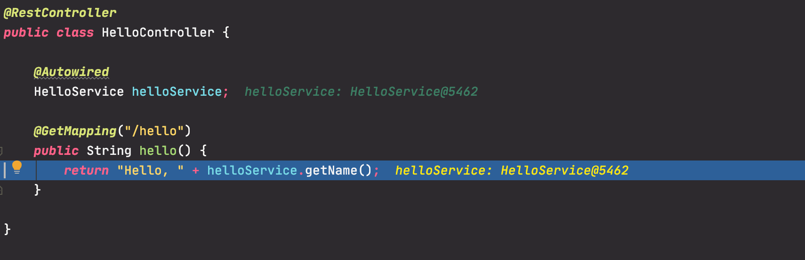

  실행한 returnValue는 문자열이 된다.

  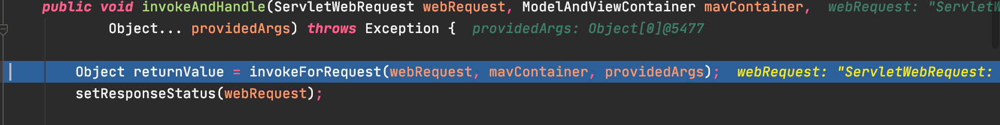

  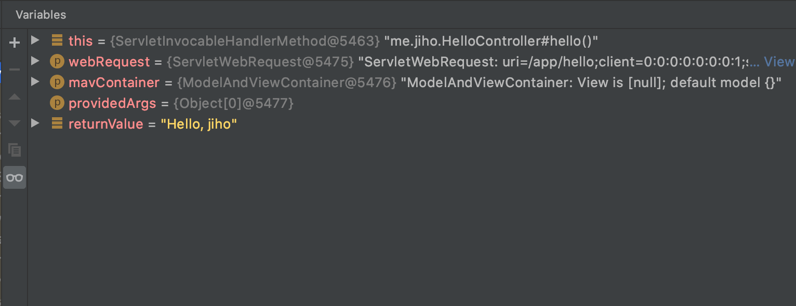

  다음으로 returnValueHandler에서 @ResponseBody가 붙어있는 String을 처리할수 있는 RequestResponseBodyMethodProcessor인 returnValueHandler를 선택하게 된다

  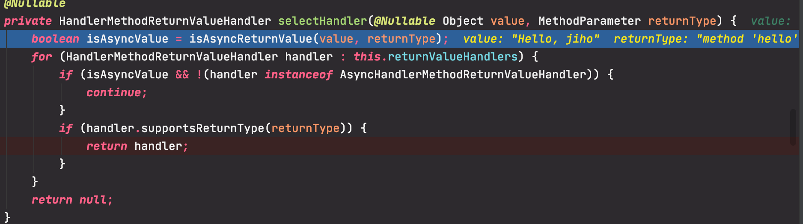

  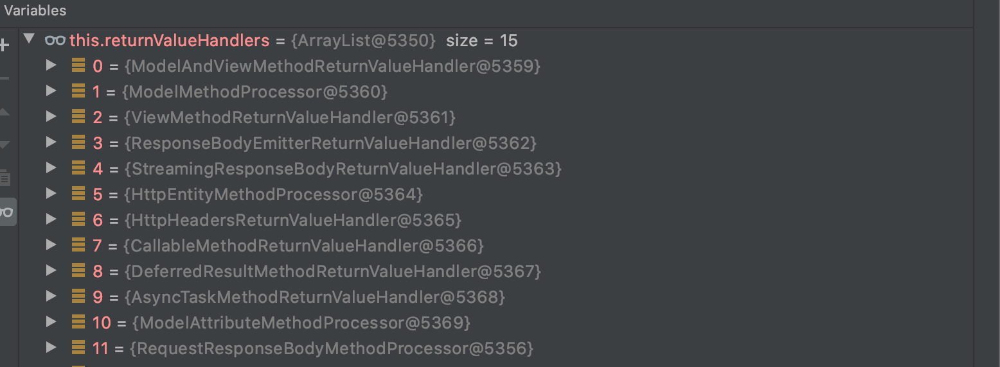

- DispatcherServlet 동작순서

  1. 요청을 분석한다
  2. 요청을 처리한 핸들러를 찾는다
  3. 핸들러를 실행할 수 있는 핸들러 어뎁터를 찾는다
  4. 핸들러 어댑터를 사용해서 핸들러의 응답을 처리한다
     - 핸들러의 리턴값을 보고 어떻게 처리할지 판단한다
       - View 이름에 해당하는 View를 찾아서 모델 데이터를 랜더링 한다
       - @ResponseEntity가 있다면 Converter를 사용해서 응답 본
  5. 예외 발생시, 예외처리 핸들러에 요청 처리를 위임한다
  6. 핸들러의 리턴값을 보고 어떻게 처리할지 판단한다
  7. 응답을 보낸다

#### View가 있는 경우

- View 만들기

  WEB-INF 아래 sample.jsp를 만들고 Controller에 매핑시킨다

  ```html
  <%@ page contentType="text/html;charset=UTF-8" language="java" %>
  <html>
  <head>
      <title>Hello</title>
  </head>
  <body>
      <h2>Hello Spring MVC</h2>
  </body>
  </html>
  ```

  ```java
  import org.springframework.beans.factory.annotation.Autowired;
  import org.springframework.stereotype.Controller;
  import org.springframework.web.bind.annotation.GetMapping;
  import org.springframework.web.bind.annotation.ResponseBody;
  import org.springframework.web.bind.annotation.RestController;
  
  @Controller
  public class HelloController {
  
      @Autowired
      HelloService helloService;
  
      @GetMapping("/hello")
      @ResponseBody
      public String hello() {
          return "Hello, " + helloService.getName();
      }
  
      @GetMapping("/sample")
      public String sample() {
          return "/WEB-INF/sample.jsp";
      }
  
  }
  ```

- 디버거를 이용한 동작원리 파악

  실행을 시켜보면 mv가 null이 아닌것을 확인할 수 있다

  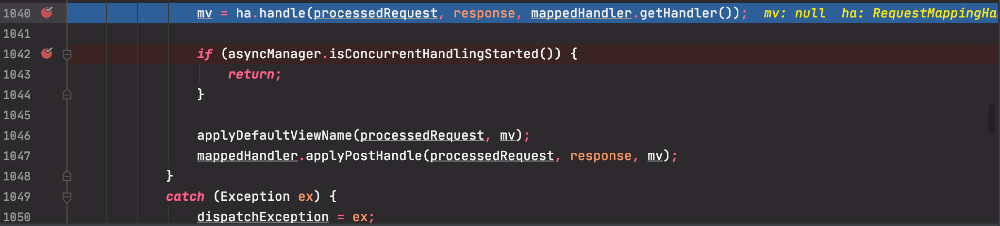

  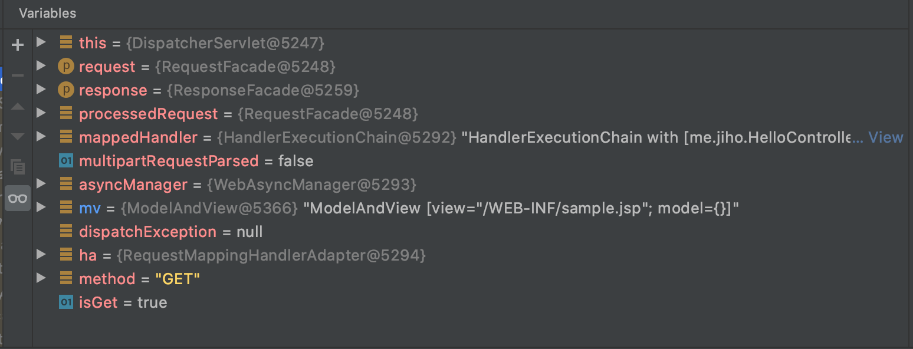

  다음과 같이 ResponseBody가 없는 경우 return 되는 String 값을 View의 이름으로 인식을한다

- 동작원리

  DispatcherServlet에는 기본적으로 등록되어 있는 BeanNameUrlHandlerMapping과 RequestMappingHandlerMapping이 있어 annotation으로 핸들러를 작성할수 있게 한다

- BeanNameUrlHandlerMapping을 이용하기

  SimpleController를 servlet.mvc의 Controller를 구현하여 다음과 같이 만든다 이런 Controller는 BeanNameUrlHandlerMapping 핸들러가 처리를 해준다

  ```java
  import javax.servlet.http.HttpServletRequest;
  import javax.servlet.http.HttpServletResponse;
  
  @org.springframework.stereotype.Controller("/simple")
  public class SimpleController implements Controller {
      @Override
      public ModelAndView handleRequest(HttpServletRequest request, 
  													HttpServletResponse response) throws Exception {
          return new ModelAndView("/WEB-INF/simple.jsp");
      }
  }
  ```

#### 커스텀 ViewResolver

- ViewResolver

  사용자가 요청에 대한 응답 View를 렌더링, View의 이름으로부터 사용될 View 객체를 매핑한다. 핸들러와 핸들러어댑터를 등록하지 않아도 DispathcerServlet에 기본으로 등록된 핸들러와 핸들러어댑터에 의해 사용자 요청이 처리 된것처럼 ViewResolver도 ViewResolver를 등록하지 않으면 기본전략을 사용하는데 이때 InternalResourceViewResolver가 등록된다.

  ```
  # Default implementation classes for DispatcherServlet's strategy interfaces.
  # Used as fallback when no matching beans are found in the DispatcherServlet context.
  # Not meant to be customized by application developers.
  
  org.springframework.web.servlet.LocaleResolver=org.springframework.web.servlet.i18n.AcceptHeaderLocaleResolver
  
  org.springframework.web.servlet.ThemeResolver=org.springframework.web.servlet.theme.FixedThemeResolver
  
  org.springframework.web.servlet.HandlerMapping=org.springframework.web.servlet.handler.BeanNameUrlHandlerMapping,\\
  	org.springframework.web.servlet.mvc.method.annotation.RequestMappingHandlerMapping,\\
  	org.springframework.web.servlet.function.support.RouterFunctionMapping
  
  org.springframework.web.servlet.HandlerAdapter=org.springframework.web.servlet.mvc.HttpRequestHandlerAdapter,\\
  	org.springframework.web.servlet.mvc.SimpleControllerHandlerAdapter,\\
  	org.springframework.web.servlet.mvc.method.annotation.RequestMappingHandlerAdapter,\\
  	org.springframework.web.servlet.function.support.HandlerFunctionAdapter
  
  org.springframework.web.servlet.HandlerExceptionResolver=org.springframework.web.servlet.mvc.method.annotation.ExceptionHandlerExceptionResolver,\\
  	org.springframework.web.servlet.mvc.annotation.ResponseStatusExceptionResolver,\\
  	org.springframework.web.servlet.mvc.support.DefaultHandlerExceptionResolver
  
  org.springframework.web.servlet.RequestToViewNameTranslator=org.springframework.web.servlet.view.DefaultRequestToViewNameTranslator
  
  org.springframework.web.servlet.ViewResolver=
  org.springframework.web.servlet.view.InternalResourceViewResolver
  
  org.springframework.web.servlet.FlashMapManager=org.springframework.web.servlet.support.SessionFlashMapManager
  ```

- 직접 ViewResolver 등록하기

  InternalResourceViewResolver는 직접 등록하지 않아도 사용이 가능하지만 직접 등록하면서 여러 설정을 할 수 있다.

  ```java
  @Configuration
  @ComponentScan
  public class WebConfig {
      
      @Bean
      public ViewResolver viewResolver() {
          InternalResourceViewResolver viewResolver = new InternalResourceViewResolver();
          viewResolver.setPrefix("/WEB-INF");
          viewResolver.setSuffix(".jsp");
      }
  }
  ```

  ```java
  package me.jiho;
  
  import org.springframework.beans.factory.annotation.Autowired;
  import org.springframework.stereotype.Controller;
  import org.springframework.web.bind.annotation.GetMapping;
  import org.springframework.web.bind.annotation.ResponseBody;
  import org.springframework.web.bind.annotation.RestController;
  
  @Controller
  public class HelloController {
  
      @Autowired
      HelloService helloService;
  
      @GetMapping("/hello")
      @ResponseBody
      public String hello() {
          return "Hello, " + helloService.getName();
      }
  
      @GetMapping("/sample")
      public String sample() {
          return "sample";
      }
  
  }
  ```

### DispatcherServlet의 구성요소

- MultipartResolver

  - 파일 업로드 요청 처리에 필요한 인터페이스
  - httpServletRequest를 MultipartHttpServletRequest로 변환하여 요청이 담고 있는 파일을 getFile()이라는 메소드를 통해 쉽게 꺼낼 수 있는 API를 제공해준다
  - 기본 전략은 DispatcherSerlvet에는 어떠한 MultipartResolver도 등록되지 않는다. 스프링 부트에서는 기본적으로 StandardServletMultipartResolver를 등록 시킨다.

  ```java
  private void initMultipartResolver(ApplicationContext context) {
  		try {
  			this.multipartResolver = context.getBean(MULTIPART_RESOLVER_BEAN_NAME, MultipartResolver.class);
  			if (logger.isTraceEnabled()) {
  				logger.trace("Detected " + this.multipartResolver);
  			}
  			else if (logger.isDebugEnabled()) {
  				logger.debug("Detected " + this.multipartResolver.getClass().getSimpleName());
  			}
  		}
  		catch (NoSuchBeanDefinitionException ex) {
  			// Default is no multipart resolver.
  			this.multipartResolver = null;
  			if (logger.isTraceEnabled()) {
  				logger.trace("No MultipartResolver '" + MULTIPART_RESOLVER_BEAN_NAME + "' declared");
  			}
  		}
  	}
  ```

- LocaleResolver

  - 클라이언트의 지역정보를 파악하는 인터페이스, 지역정보에 따라 MessageSource에서 적절한 지역언어로 화면에 보여 줄수 있다.
  - 기본 전략은 AcceptHeaderLocaleResolver로 요청의 accept-language를 보고 판단한다

  ```java
  private void initLocaleResolver(ApplicationContext context) {
  		try {
  			this.localeResolver = context.getBean(LOCALE_RESOLVER_BEAN_NAME, LocaleResolver.class);
  			if (logger.isTraceEnabled()) {
  				logger.trace("Detected " + this.localeResolver);
  			}
  			else if (logger.isDebugEnabled()) {
  				logger.debug("Detected " + this.localeResolver.getClass().getSimpleName());
  			}
  		}
  		catch (NoSuchBeanDefinitionException ex) {
  			// We need to use the default.
  			this.localeResolver = getDefaultStrategy(context, LocaleResolver.class);
  			if (logger.isTraceEnabled()) {
  				logger.trace("No LocaleResolver '" + LOCALE_RESOLVER_BEAN_NAME +
  						"': using default [" + this.localeResolver.getClass().getSimpleName() + "]");
  			}
  		}
  	}
  ```

- ThemeResolver

  - 애플리케이션에 설정된 테마를 파악하고 변경할 수 있는 인터페이스

  ```java
  private void initThemeResolver(ApplicationContext context) {
  		try {
  			this.themeResolver = context.getBean(THEME_RESOLVER_BEAN_NAME, ThemeResolver.class);
  			if (logger.isTraceEnabled()) {
  				logger.trace("Detected " + this.themeResolver);
  			}
  			else if (logger.isDebugEnabled()) {
  				logger.debug("Detected " + this.themeResolver.getClass().getSimpleName());
  			}
  		}
  		catch (NoSuchBeanDefinitionException ex) {
  			// We need to use the default.
  			this.themeResolver = getDefaultStrategy(context, ThemeResolver.class);
  			if (logger.isTraceEnabled()) {
  				logger.trace("No ThemeResolver '" + THEME_RESOLVER_BEAN_NAME +
  						"': using default [" + this.themeResolver.getClass().getSimpleName() + "]");
  			}
  		}
  	}
  ```

- HandlerMapping

  - 요청을 처리할 핸들러를 찾는 인터페이스
  - annotation기반으로 Mapping 시킨경우 RequestMappingHandlerMapping이 사용된다

- HandlerAdapter

  - HandlerMapping이 찾아낸 Handler를 호출하고 처리하는 인터페이스, 실제 요청을 처리하는 인터페이스이다.
  - annotation을 기반으로 Mapping 시킨경우 RequestMappingHandlerAdapter가 사용된다

- HandlerExceptionResolver

  - 요청 처리중에 발생한 에러를 처리하는 인터페이스
  - @ExceptionHandler로 정의하는 방법이 있는데 이때 ExceptionHandlerExceptionResolver가 사용된다

- RequestToViewNameTranslator

  - 핸들러에서 뷰 이름을 명시적으로 리턴하지 않은경우, 요청을 기반으로 뷰이름을 판단하는 인터페이스

  ```java
  @GetMapping("/test")
      public void test() {
      }
  ```

- ViewResolver

  핸들러에서 반환하는 String에 해당하는 View를 찾아내는 인터페이스 기본적으로 InternalResourceViewResolver 가 등록되어 있다. InternalResourceViewResolver는 기본적으로 jsp를 지원해서 jsp View를 사용할수 있다

- FlashMapManager

  - Redirect(reflash할때 같은데이터를 다시 보내지 않게)를 할때 요청 매개변수를 사용하지 않고 데이터를 전달하고 정리할 때 사용
  - 기본전략으로 SessionFlashMapManager를 사용한다