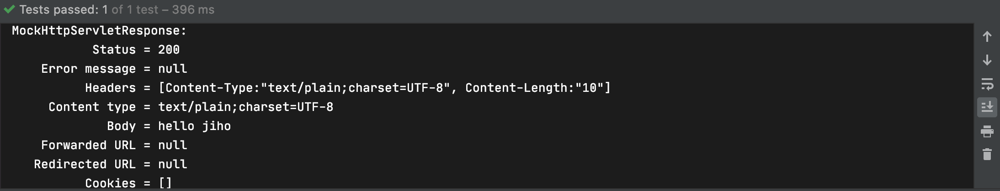
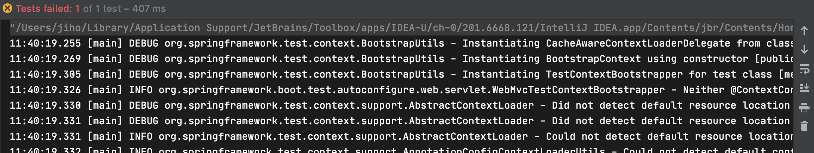
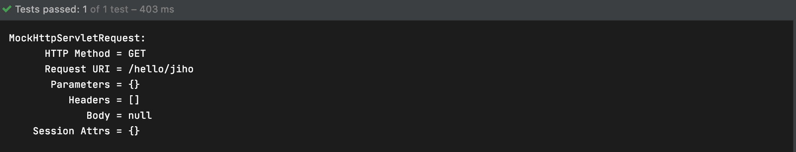

## Formatter

### 목차

1. [Formatter 소개](#formatter-소개)
2. [Formatter 적용하기](#formatter-적용하기)

### Formatter 소개

- Formatter

  String과 Object 사이를 변환해준다 `Printer<T>`와 `Parser<T>`을 상속받은 인터페이스이다

  - Printer: 해당 객체를 문자열로 출력
  - Parser: 문자열을 객체로 변환

- Formatter가 없는 경우

  아래와 같은 Person 클래스가 있고

  ```java
  package me.jiho.springmvcdemo;
  
  public class Person {
  
      private String name;
  
      public String getName() {
          return name;
      }
  
      public void setName(String name) {
          this.name = name;
      }
  }
  ```

  Controller에서 `@PathVariable` annotation을 이용해 path의 값을 Person 객체로 받으려고 한다

  ```java
  import org.springframework.web.bind.annotation.GetMapping;
  import org.springframework.web.bind.annotation.PathVariable;
  import org.springframework.web.bind.annotation.RestController;
  
  @RestController
  public class SampleController {
  
      @GetMapping("/hello/{name}")
      public String hello(@PathVariable("name") Person person) {
          return "hello" + person.getName();
      }
  }
  ```

  Test를 실행하면 실패하는 것을 확인 할 수 있는데 이는 `String`인 {name}을 `Person`이라는 객체로 바꿀 Formatter가 등록되지 않았기 때문이다

  ```java
  package me.jiho.springmvcdemo;
  
  import org.junit.jupiter.api.Test;
  import org.junit.jupiter.api.extension.ExtendWith;
  import org.springframework.beans.factory.annotation.Autowired;
  import org.springframework.boot.test.autoconfigure.web.servlet.WebMvcTest;
  import org.springframework.test.context.junit.jupiter.SpringExtension;
  import org.springframework.test.web.servlet.MockMvc;
  
  import static org.junit.jupiter.api.Assertions.*;
  import static org.springframework.test.web.servlet.request.MockMvcRequestBuilders.get;
  import static org.springframework.test.web.servlet.result.MockMvcResultHandlers.print;
  import static org.springframework.test.web.servlet.result.MockMvcResultMatchers.content;
  
  @ExtendWith(SpringExtension.class)
  @WebMvcTest
  class SampleControllerTest {
  
      @Autowired
      MockMvc mockMvc;
  
      @Test
      public void hello() throws Exception {
          this.mockMvc.perform(get("/hello/jiho"))
                  .andDo(print())
                  .andExpect(content().string("hello jiho"));
      }
  }
  ```

  @RequestParam의 경우("/hello?name=jiho"와 같이 사용하는 경우)도 Formatter가 없으면 동작하지 않는다

  ```java
  @RestController
  public class SampleController {
      
      @GetMapping("/hello")
      public String hello(@RequestParam("name") Person person) {
          return "hello " + person.getName();
      }
  }
  ```

### Formatter 적용하기

- Formatter 만들기

  Formatter 인터페이스를 구현하여 PersonFormatter를 만든다

  ```java
  public class PersonFormatter implements Formatter<Person> {
  
      @Override
      public Person parse(String text, Locale locale) throws ParseException {
          Person person = new Person();
          person.setName(text);
          return person;
      }
  
      @Override
      public String print(Person object, Locale locale) {
          return object.toString();
      }
  }
  ```

- Formatter를 등록하는 방법

  1. WebMvcConfigurer의 addFormatters(FormatterRegistry)메소드 이용

     ```java
     @Configuration
     public class WebConfig implements WebMvcConfigurer {
         @Override
         public void addFormatters(FormatterRegistry registry) {
             registry.addFormatter(new PersonFormatter());
         }
     }
     ```

     

  2. (스프링 부트 사용시) Formatter를 빈으로 등록

     ```java
     @Component
     public class PersonFormatter implements Formatter<Person> {
     
         @Override
         public Person parse(String text, Locale locale) throws ParseException {
             Person person = new Person();
             person.setName(text);
             return person;
         }
     
         @Override
         public String print(Person object, Locale locale) {
             return object.toString();
         }
     }
     ```

     실제 실행시 잘 동작하지만 test를 실행하면 실패하는것을 볼수 있는데 @WebMvcTest가 Slice 테스트로 웹과 관련된 Bean만 등록하기 때문이다 @Component annotation으로 빈으로 등록했기 때문에 스프링부트에서 웹과 관련된 빈으로 인식하지 못한다

     

     해결하는 방법은 통합테스트인 @SpringBootTest annotation을 이용하고 @SpringBootTest의 경우 mockMvc를 빈으로 등록하지 않기 때문에 @AutoConfigureMockMvc annotation을 이용해 mockMvc를 빈으로 등록시킨다

     ```java
     @ExtendWith(SpringExtension.class)
     @SpringBootTest
     @AutoConfigureMockMvc
     class SampleControllerTest {
     
         @Autowired
         MockMvc mockMvc;
     
         @Test
         public void hello() throws Exception {
             this.mockMvc.perform(get("/hello/jiho"))
                     .andDo(print())
                     .andExpect(content().string("hello jiho"));
         }
     }
     ```

     