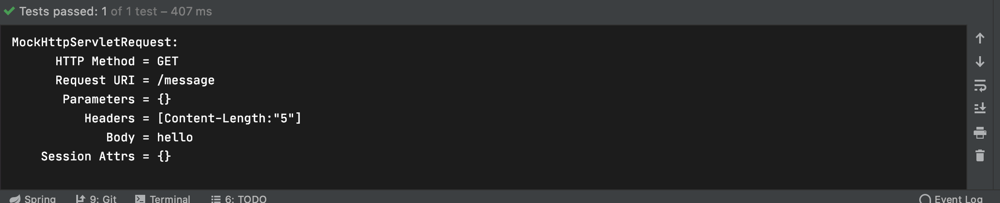
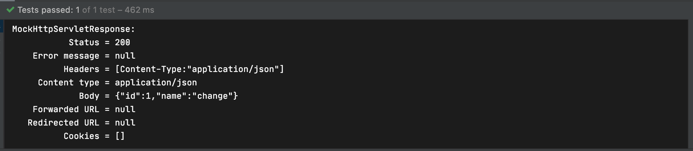

## HTTP Message Converter

### Http Message Converter: 소개

- HTTP Message Converter

  Controller에서 @RequestBody annotation을 이용해 요청 본문에서 메시지를 읽어들이거나, @ResponseBody를 이용해 응답 본문에 메시지를 작성할때 사용한다

  ```java
  @Controller
  public class SampleController {
  
      @GetMapping("/message")
      @ResponseBody
      public String message(@RequestBody Person person) {
          return "hello" + person.getName();
      }
  
  }
  ```

  Controller가 @RestController인 경우 @ResponseBody가 항상 포함된다

  ```java
  @RestController
  public class SampleController {
  
      @GetMapping("/message")
      public String message(@RequestBody String body) {
          return body + " jiho";
      }
  
  }
  ```

- 기본 HTTP Message Converter

  - ByteArray
  - String
  - Resource
  - Form
  - (JAXB2)
  - (Jackson2)
  - (Jackson)
  - (Gson)
  - (Atom)
  - (RSS)

  괄호 안의 Converter는 클래스 패스에 해당 라이브러리가 있는경우에 자동으로 HTTP Message Converter로 등록해준다

  메시지 컨버터는 RequestHeader에 Content-Type에 따라 결정된다

- 기본 메시지 컨버터 테스트

  기본적으로 String Converter가 있기 때문에 요청본문에 들어있는 문자열을 그대로 문자열로 받거나, 핸들러에서 리턴하는 문자열을 그대로 응답 메시지에 쓰는 것이 가능하다

  ```java
  @Test
      public void stringMessage() throws Exception {
          this.mockMvc.perform(get("/message")
              .content("hello"))
                  .andDo(print())
                  .andExpect(status().isOk())
                  .andExpect(content().string("hello jiho"))
      }
  ```

  

### HTTP Message Converter 등록하기

- Message Converter 등록방법

  1. extendMessageConverters

     기본으로 등록해주는 Converter에 새로운 Converter 추가하기

  2. configureMessageConverters

     기본으로 등록해주는 Converter 다 없애고 새로운 Converter 추가

     ```java
     @Configuration
     public class WebConfig implements WebMvcConfigurer {
         @Override
         public void configureMessageConverters(List<HttpMessageConverter<?>> converters) {
         }
     
         @Override
         public void extendMessageConverters(List<HttpMessageConverter<?>> converters) {
             
         }
     }
     ```

  3. 의존성 추가로 Converter 등록하기

     @EnableWebMvc annotation을 설정했을때 의존성에 따라 HTTPMessageConverter가 자동으로 등록된다

     ```java
     public class WebMvcConfigurationSupport implements ApplicationContextAware, ServletContextAware {
     	//...
     	protected final void addDefaultHttpMessageConverters(List<HttpMessageConverter<?>> messageConverters) {
     		messageConverters.add(new ByteArrayHttpMessageConverter());
     		messageConverters.add(new StringHttpMessageConverter());
     		messageConverters.add(new ResourceHttpMessageConverter());
     		messageConverters.add(new ResourceRegionHttpMessageConverter());
     		try {
     			messageConverters.add(new SourceHttpMessageConverter<>());
     		}
     		catch (Throwable ex) {
     			// Ignore when no TransformerFactory implementation is available...
     		}
     		messageConverters.add(new AllEncompassingFormHttpMessageConverter());
     
     		//...
     		if (jackson2Present) {
     			Jackson2ObjectMapperBuilder builder = Jackson2ObjectMapperBuilder.json();
     			if (this.applicationContext != null) {
     				builder.applicationContext(this.applicationContext);
     			}
     			messageConverters.add(new MappingJackson2HttpMessageConverter(builder.build()));
     		}
     		else if (gsonPresent) {
     			messageConverters.add(new GsonHttpMessageConverter());
     		}
     		else if (jsonbPresent) {
     			messageConverters.add(new JsonbHttpMessageConverter());
     		}
     		//...
     	}
     
     	//...
     }
     ```

### HTTP Message Converter: JSON

- 스프링 부트를 사용하지 않는 경우

  사용하고 싶은 JSON 라이브러리를 의존성으로 추가한다

- 스프링 부트를 사용하는 경우

  기본적으로 jacksonJSON2가 의존성에 들어가 있다

  - Controller만들기

    Controller에 @RequestBody로 JSON을 받아 이를 person 객체로 변환하고 이를 다시 person을 리턴하여 JSON으로 출력하고자 한다

    ```java
    @RestController
    public class SampleController {
    		
    		//...
        @GetMapping("/jsonMessage")
        public Person jsonMessage(@RequestBody Person person) {
    				person.setName("change");
            return person;
        }
    
    }
    ```

  - Test 작성

    json이 제공하는 ObjectMapper를 이용해 content에 넣을 person 객체를 json 형식으로 변환한다 헤더에 ContentType과 Accept를 JSON으로 설정하고 테스트를 진행하였다

    ```java
    @ExtendWith(SpringExtension.class)
    @SpringBootTest
    @AutoConfigureMockMvc
    class SampleControllerTest {
    
        @Autowired
        MockMvc mockMvc;
    
        @Autowired
        ObjectMapper objectMapper;
    
        @Test
        public void jsonMessage() throws Exception {
            Person person = new Person();
            person.setId(1l);
            person.setName("jiho");
    
            String jsonString = objectMapper.writeValueAsString(person);
            this.mockMvc.perform(get("/jsonMessage")
                        .contentType(MediaType.APPLICATION_JSON)
                        .accept(MediaType.APPLICATION_JSON)
                        .content(jsonString))
                    .andDo(print())
                    .andExpect(status().isOk())
    								.andExpect(jsonPath("$.name").value("change"));
        }
    ```

    

