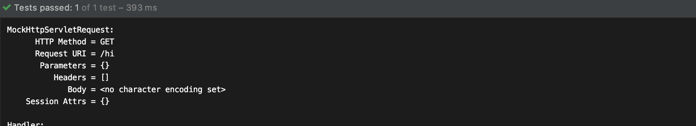
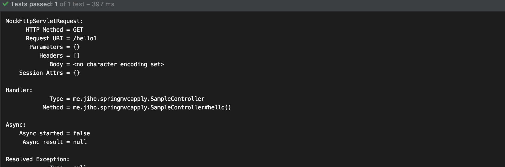
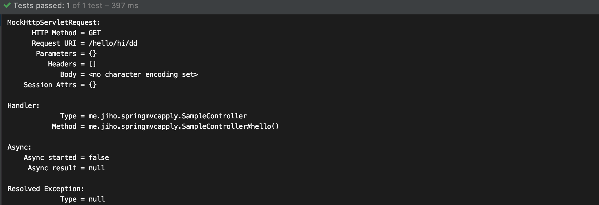
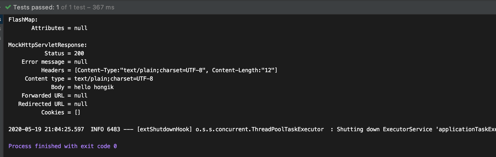

## URI 패턴 맵핑

### 여러  문자열과 맵핑

@RequestMapping과 @GetMapping 등의 annotation에 배열 형태로 URI를 넣어준 경우 여러 문자열과 맵핑이 가능하다

```java
import org.springframework.stereotype.Controller;
import org.springframework.web.bind.annotation.GetMapping;
import org.springframework.web.bind.annotation.RequestMapping;
import org.springframework.web.bind.annotation.RequestMethod;
import org.springframework.web.bind.annotation.ResponseBody;

@Controller
@RequestMapping(method = RequestMethod.GET)
public class SampleController {

    @RequestMapping({"/hello", "/hi"}) //http메소드를 지정하지 않으면 모든 http 메소드 허용
    @ResponseBody // 없으면 이름에 해당하는 뷰로 돌아간다, 있으면 문자열을 응답으로 보냄
    public String hello() {
        return "hello";
    }

}
```

```java
import static org.junit.jupiter.api.Assertions.*;
import static org.springframework.test.web.servlet.request.MockMvcRequestBuilders.get;
import static org.springframework.test.web.servlet.request.MockMvcRequestBuilders.put;
import static org.springframework.test.web.servlet.result.MockMvcResultHandlers.print;
import static org.springframework.test.web.servlet.result.MockMvcResultMatchers.content;
import static org.springframework.test.web.servlet.result.MockMvcResultMatchers.status;

@ExtendWith(SpringExtension.class)
@WebMvcTest //mock을 주입해준다
class SampleControllerTest {

    @Autowired
    MockMvc mockMvc;

    @Test
    public void helloTest() throws Exception{
        mockMvc.perform(get("/hello"))
                .andDo(print())
                .andExpect(status().isOk())
                .andExpect(content().string("hello"));

        mockMvc.perform(get("/hi"))
                .andDo(print())
                .andExpect(status().isOk())
                .andExpect(content().string("hello"));
    }

}
```



### 특정 패턴으로 맵핑하기

@RequestMapping은 다음의 패턴을 지원한다

- ?

  한 글자와 맵핑된다

  "/hello/??" → "/hello/ee"

  ```java
  import org.springframework.stereotype.Controller;
  import org.springframework.web.bind.annotation.GetMapping;
  import org.springframework.web.bind.annotation.RequestMapping;
  import org.springframework.web.bind.annotation.RequestMethod;
  import org.springframework.web.bind.annotation.ResponseBody;
  
  @Controller
  @RequestMapping(method = RequestMethod.GET)
  public class SampleController {
  
      @GetMapping("/hello?")
      @ResponseBody 
      public String hello() {
          return "hello";
      }
  
  }
  ```

  ```java
  @ExtendWith(SpringExtension.class)
  @WebMvcTest //mock을 주입해준다
  class SampleControllerTest {
  
      @Autowired
      MockMvc mockMvc;
  
      @Test
      public void helloTest() throws Exception{
          mockMvc.perform(get("/hello1"))
                  .andDo(print())
                  .andExpect(status().isOk())
                  .andExpect(content().string("hello"));
  
      }
  
  }
  ```

  

- *

  여러 글자와 맵핑된다

  "/hello/*" → "hello/hongik"

- **

  여러 패스와 맵핑된다

  "hello/**" → "hello/hongik/ce"

- 클래스에 선언한 @RequestMapping과 조합

  클래스에 @RequestMapping annotation이 있는 경우 클래스의 @RequestMapping annotation URI 패턴 뒤에 이어서 메소드에 있는 @RequestMapping이 조합된다

  ```java
  import org.springframework.stereotype.Controller;
  import org.springframework.web.bind.annotation.GetMapping;
  import org.springframework.web.bind.annotation.RequestMapping;
  import org.springframework.web.bind.annotation.RequestMethod;
  import org.springframework.web.bind.annotation.ResponseBody;
  
  @Controller
  @RequestMapping("/hello")
  public class SampleController {
  
      @GetMapping("/**")
      @ResponseBody
      public String hello() {
          return "hello";
      }
  
  }
  ```

  ```java
  import static org.junit.jupiter.api.Assertions.*;
  import static org.springframework.test.web.servlet.request.MockMvcRequestBuilders.get;
  import static org.springframework.test.web.servlet.request.MockMvcRequestBuilders.put;
  import static org.springframework.test.web.servlet.result.MockMvcResultHandlers.print;
  import static org.springframework.test.web.servlet.result.MockMvcResultMatchers.content;
  import static org.springframework.test.web.servlet.result.MockMvcResultMatchers.status;
  
  @ExtendWith(SpringExtension.class)
  @WebMvcTest //mock을 주입해준다
  class SampleControllerTest {
  
      @Autowired
      MockMvc mockMvc;
  
      @Test
      public void helloTest() throws Exception{
          mockMvc.perform(get("/hello/hi/dd"))
                  .andDo(print())
                  .andExpect(status().isOk())
                  .andExpect(content().string("hello"));
  
      }
  ```

  

### 정규 표현식으로 맵핑

정규 표현식을 이용해 맵핑을 할 수 있다 @PathVariable을 이용해 path를 받아와 name으로 데이터 바인딩을 하고 이를 출력하였다

  ```java
  import org.springframework.stereotype.Controller;
  import org.springframework.web.bind.annotation.*;
  
  @Controller
  @RequestMapping("/hello")
  public class SampleController {
  
      @GetMapping("/{name:[a-z]+}")
      @ResponseBody
      public String hello(@PathVariable String name) {
          return "hello " + name;
      }
  
  }
  ```

  ```java
  @Test
      public void helloTest() throws Exception{
          mockMvc.perform(get("/hello/hongik"))
                  .andDo(print())
                  .andExpect(status().isOk())
                  .andExpect(content().string("hello hongik"));
  
      }
  ```

- 패턴이 중복될때

  가장 구체적으로 맵핑되는 핸들러가 선택된다

  ```java
  import org.springframework.stereotype.Controller;
  import org.springframework.web.bind.annotation.*;
  
  @Controller
  @RequestMapping("/hello")
  public class SampleController {
  
      @GetMapping("/hongik")
      @ResponseBody
      public String helloHongik() {
          return "hello hongik";
      }
  
      @GetMapping("/**")
      @ResponseBody
      public String hello() {
          return "hello";
      }
  }
  ```
  
```java
  @Test
      public void helloTest() throws Exception{
          mockMvc.perform(get("/hello/hongik"))
                  .andDo(print())
                  .andExpect(status().isOk())
                  .andExpect(content().string("hello hongik"));
  
      }
  ```
  


### URI 확장자 맵핑

- 스프링 MVC의 경우

    @RequestMapping("/hi")로 작성한경우 @RequestMapping({"/hi", "/hi.*"})로 맵핑을 자동으로 해준다

- 스프링 부트의 경우

    보안 이슈(RFD Attack), URI변수 매개변수, URI 인코딩을 사용할 때 불명확 함으로 지원 해주지 않는다