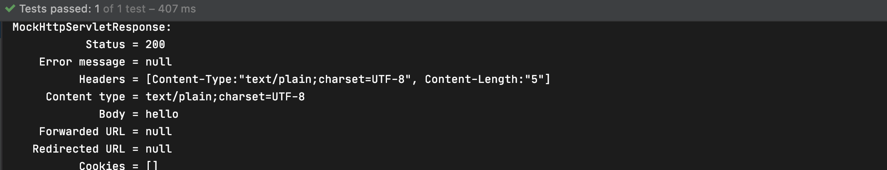
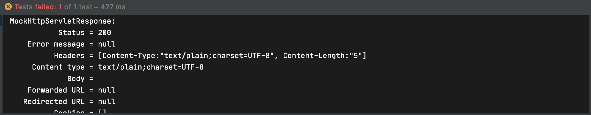
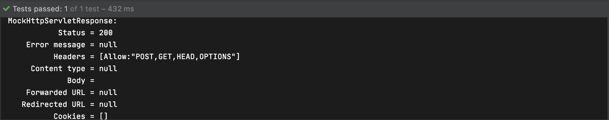

## HTTP 요청 맵핑하기: HEAD와 OPTION 요청 처리

HEAD와 OPRIONS는 구현하지 않아도 스프링 웹 MVC에서 자동으로 처리하는 HTTP 메소드이다

### HEAD

GET 요청과 동일하지만 응답 본문을 받아 오지 않고 응답 헤더만 받아 온다

GET Mapping이 있을 때 구현

```java
@Controller
public class SampleController {

    @RequestMapping(value = "/hello", method = RequestMethod.GET)
    // "From"으로 작성해도 됨
    @ResponseBody // 없으면 이름에 해당하는 뷰로 돌아간다, 있으면 문자열을 응답으로 보냄
    public String hello() {
        return "hello";
    }

}
```

테스트에서 GET으로 요청을 보내는 경우이다

```java
@ExtendWith(SpringExtension.class)
@WebMvcTest //mock을 주입해준다
class SampleControllerTest {

    @Autowired
    MockMvc mockMvc;

    @Test
    public void helloTest() throws Exception{
        mockMvc.perform(get("/hello"))
                .andDo(print())
                .andExpect(status().isOk())
                .andExpect(content().string("hello"));
    }
}
```



HEAD로 보낸경우 content에 hello가 없어 실패하는 것을 확인 할 수 있다

```java
@ExtendWith(SpringExtension.class)
@WebMvcTest //mock을 주입해준다
class SampleControllerTest {

    @Autowired
    MockMvc mockMvc;

    @Test
    public void helloTest() throws Exception{
        mockMvc.perform(head("/hello"))
                .andDo(print())
                .andExpect(status().isOk())
                .andExpect(content().string("hello"));
    }
}
```



### OPTIONS

- 사용할 수 있는 HTTP Method 제공
- 서버 또는 특정 리소스가 제공하는 기능을 확인 할 수 있다
- 서버는 Allow 응답 헤더에 사용할 수 있는 HTTP method 목록을 제공해야 한다

```java
@Controller
public class SampleController {

    @RequestMapping(value = "/hello", method = RequestMethod.GET)
    // "From"으로 작성해도 됨
    @ResponseBody // 없으면 이름에 해당하는 뷰로 돌아간다, 있으면 문자열을 응답으로 보냄
    public String hello() {
        return "hello";
    }

    @PostMapping("/hello")
    @ResponseBody
    public String helloPost() {
        return "hello";
    }

}
```

```java
import org.junit.jupiter.api.Test;
import org.junit.jupiter.api.extension.ExtendWith;
import org.springframework.beans.factory.annotation.Autowired;
import org.springframework.boot.test.autoconfigure.web.servlet.WebMvcTest;
import org.springframework.http.HttpHeaders;
import org.springframework.http.MediaType;
import org.springframework.test.context.junit.jupiter.SpringExtension;
import org.springframework.test.web.servlet.MockMvc;
import org.springframework.test.web.servlet.ResultHandler;

import static org.junit.jupiter.api.Assertions.*;
import static org.springframework.test.web.servlet.request.MockMvcRequestBuilders.*;
import static org.springframework.test.web.servlet.result.MockMvcResultHandlers.print;
import static org.springframework.test.web.servlet.result.MockMvcResultMatchers.content;
import static org.springframework.test.web.servlet.result.MockMvcResultMatchers.status;

@ExtendWith(SpringExtension.class)
@WebMvcTest //mock을 주입해준다
class SampleControllerTest {

    @Autowired
    MockMvc mockMvc;

    @Test
    public void helloTest() throws Exception{
        mockMvc.perform(options("/hello"))
                .andDo(print())
                .andExpect(status().isOk());
    }
}
```

