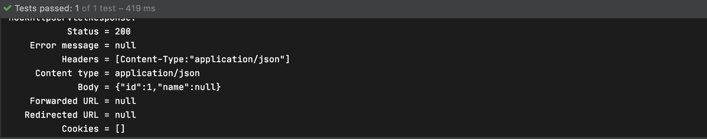

## URI 패턴 맵핑

### @PathVariable

- 요청 URI 패턴의 일부를 핸들러 메소드 아규먼트로 받는 방법
- 타입 변환을 지원한다
- Optional을 지원한다
- 아규먼트의 이름과 {value} 값이 다른경우 @PathVariable("value")로 표시해주어야 한다

String으로 입력 받은 id가 Interger로 변환 된 것을 확인 할 수 있다 return 부분에 evnet 인스턴스를 리턴 했지만 HttpMessageConverte가 클래스 타입을 JSON 타입으로 변환 해 준다

```java
@Controller
public class SampleController {

    @GetMapping("/events/{id}")
    @ResponseBody
    public Event events(@PathVariable Integer id) {
        Event event = new Event();
        event.setId(id);
        return event;
    }
}
```

```java
@ExtendWith(SpringExtension.class)
@WebMvcTest //mock을 주입해준다
class SampleControllerTest {

    @Autowired
    MockMvc mockMvc;

    @Test
    public void eventsTest() throws Exception{
        mockMvc.perform(get("/events/1"))
                .andDo(print())
                .andExpect(status().isOk())
                .andExpect(jsonPath("id").value(1));
    }
}
```



### @MatrixVariables

- 요청 URI 패턴에서 키/쌍 값의 데이터를 메소드 아큐먼트로 받는방법

- 타입 변환을 지원한다

- Optional을 지원한다

- 기본적으로 비활성화 되어 있다

  활성화 하려면 @Configuration annotation을 이용해 설정 파일로 등록하고 configurePathMatch에서 UrlPathHelper에서 setRemoveSemicolonContent를 false로 하여 세미콜론을 없애지 않게 설정한다

  ```java
  import org.springframework.context.annotation.Configuration;
  import org.springframework.web.servlet.config.annotation.PathMatchConfigurer;
  import org.springframework.web.servlet.config.annotation.WebMvcConfigurer;
  import org.springframework.web.util.UrlPathHelper;
  
  @Configuration
  public class WebConfig implements WebMvcConfigurer {
      @Override
      public void configurePathMatch(PathMatchConfigurer configurer) {
          UrlPathHelper urlPathHelper = new UrlPathHelper();
          urlPathHelper.setRemoveSemicolonContent(false);
          configurer.setUrlPathHelper(urlPathHelper);
      }
  }
  ```

  ```java
  @Controller
  public class SampleController {
  
      @GetMapping("/events/{id}")
      @ResponseBody
      public Event events(@PathVariable Integer id, @MatrixVariable String name) {
          Event event = new Event();
          event.setId(id);
          event.setName(name);
          return event;
      }
  }
  ```

  ```java
  @ExtendWith(SpringExtension.class)
  @WebMvcTest
  class SampleControllerTest {
  
      @Autowired
      MockMvc mockMvc;
  
      @Test
      public void eventsTest() throws Exception{
          mockMvc.perform(get("/events/1;name=hahaha"))
                  .andDo(print())
                  .andExpect(status().isOk())
                  .andExpect(jsonPath("id").value(1))
                  .andExpect(jsonPath("name").value("hahaha"));
      }
  }
  ```