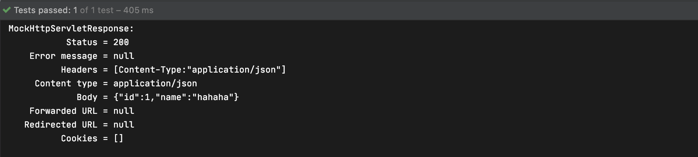
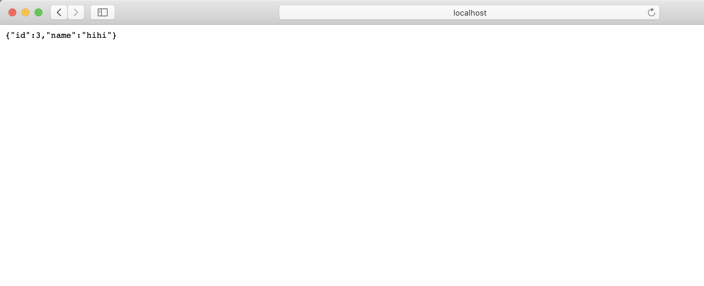

## 핸들러 메소드: 요청 매개변수

### 요청 매개변수

- "/events?name=jiho" URI 같이 쿼리 파라미터로 보내는 경우
- 요청본문에 form 데이터로 보내는 경우

### `@RequestParam`

- 요청 매개변수에 들어있는 단순 타입 데이터(클래스)를 메소드 아규먼트로 받아올 수 있다
- 값이 반드시 있어야한다
- Optional을 지원한다
- String이 아닌 값들은 타입 컨버전을 지원한다
- Map<String, String> 또는 MultiValueMap<String, String>에 사용해서 모든 요청 매개변수를 받아올 수 있다
- 아규먼트의 이름과 "?key=value" 의 키 값이 다른 경우 @RequestParam(value = "key")로 표시해 주어야 한다
- 생략할 수 있다

```java
import org.springframework.http.HttpMethod;
import org.springframework.stereotype.Controller;
import org.springframework.web.bind.annotation.*;

import javax.servlet.http.PushBuilder;
import java.util.Map;

@Controller
public class SampleController {

    @PostMapping("/events")
    @ResponseBody
    public Event events(@RequestParam String name,
                        @RequestParam Integer id) {
        Event event = new Event();
        event.setName(name);
        event.setId(id);
        return event;
    }
}
```

```java
@ExtendWith(SpringExtension.class)
@WebMvcTest //mock을 주입해준다
class SampleControllerTest {

    @Autowired
    MockMvc mockMvc;

    @Test
    public void eventsTest() throws Exception{
        mockMvc.perform(post("/events?name=hahaha&id=1"))
                .andDo(print())
                .andExpect(status().isOk())
                .andExpect(jsonPath("name").value("hahaha"))
                .andExpect(jsonPath("id").value("1"));
    }
}
```



Map<String,String>을 사용하는 경우

```java
import org.springframework.http.HttpMethod;
import org.springframework.stereotype.Controller;
import org.springframework.web.bind.annotation.*;

import javax.servlet.http.PushBuilder;
import java.util.Map;

@Controller
public class SampleController {

    @PostMapping("/events")
    @ResponseBody
    public Event events(@RequestParam Map<String, String> names) {
        Event event = new Event();
        event.setName(names.get("name"));
        return event;
    }
}
```

### 폼 서브밋

- 폼을 보여줄 요청 처리

  Model.addAttribue("events", new Event());를 이용해 폼을 채워줄 form backing object를 넘겨준다

  ```java
  @Controller
  public class SampleController {
  
      @GetMapping("/events/form")
      public String evnetsForm(Model model) {
          model.addAttribute("event", new Event());
          return "events/form";
      }
  		@PostMapping("/events")
      @ResponseBody
      public Event events(@RequestParam String name,
                          @RequestParam Integer id) {
          Event event = new Event();
          event.setName(name);
          event.setId(id);
          return event;
      }
  }
  ```

  resource/templates/events안에 form.html을 만든다 th:object="${event}"를 이용해 모델에서 넘겨준 데이터를 참조 th:field=" *{name}"를 이용해 event.name을 선택한다 submit을 하면 th:action="@{/evnets}"로 "/events"로 요청된다

  ```html
  <!DOCTYPE html>
  <html lang="en" xmlns:th="<http://www.thymeleaf.org>">
  <head>
      <meta charset="UTF-8">
      <title>Creat New Event</title>
  </head>
  <body>
  <form action="#" th:action="@{/events}" method="post" th:object="${event}">
      <input type="text" title="id" th:field="*{id}">
      <input type="text" title="name" th:field=" *{name}">
      <input type="submit" value="Create">
  </form>
  </body>
  </html>
  ```

  

  