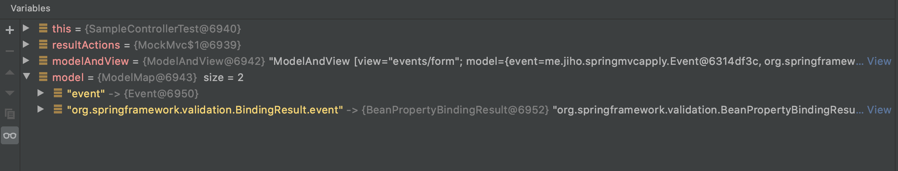
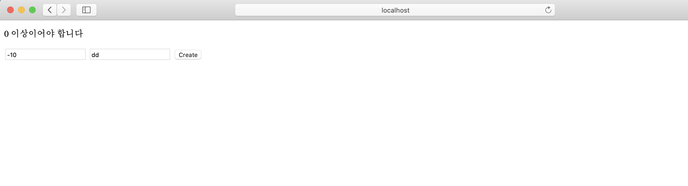
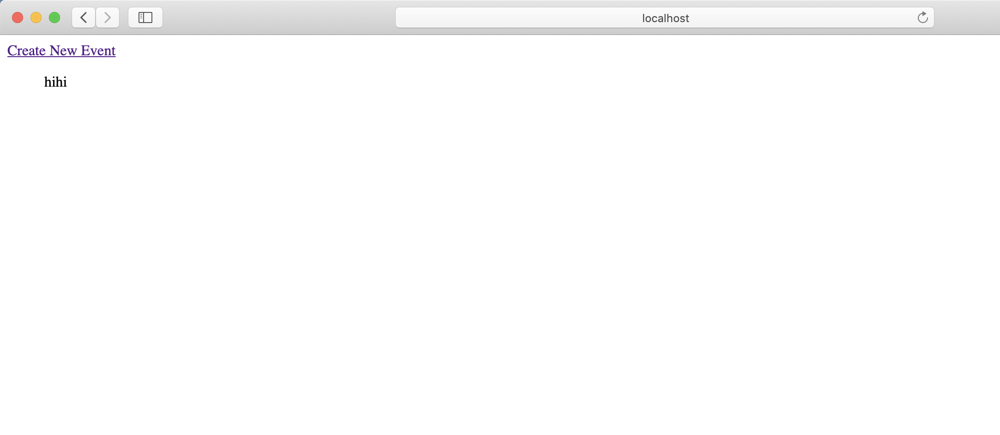
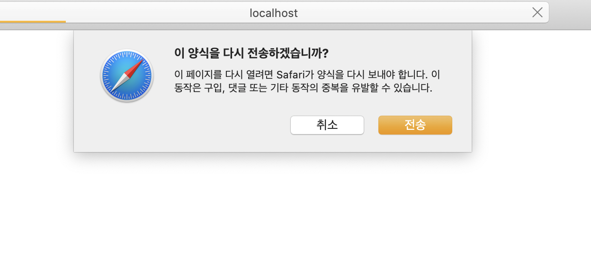

## 폼 서브밋 에러처리

### 바인딩 에러 발생시 Model에 담기는 정보

- Event
- BindingResult.event

```java
import org.springframework.stereotype.Controller;
import org.springframework.ui.Model;
import org.springframework.validation.BindingResult;
import org.springframework.validation.annotation.Validated;
import org.springframework.web.bind.annotation.*;

@Controller
public class SampleController {

    @GetMapping("/events/form")
    public String evnetsForm(Model model) {
        model.addAttribute("event", new Event());
        return "events/form";
    }

    @PostMapping("/events")
    public String events(@Validated @ModelAttribute Event event, BindingResult bindingResult) {
        if (bindingResult.hasErrors()) {
            return "events/form";
        }
        return "events/list";
    }
}
```

Test를 수정하여 model을 볼수 있게 하였다 디버거를 이용해 model의 정보를 출력하였다

```java
@ExtendWith(SpringExtension.class)
@WebMvcTest
class SampleControllerTest {

    @Autowired
    MockMvc mockMvc;

    @Test
    public void eventsTest() throws Exception{
        ResultActions resultActions = mockMvc.perform(post("/events?name=hahaha&id=-1"))
                .andDo(print())
                .andExpect(status().isOk())
                .andExpect(model().hasErrors());
        ModelAndView modelAndView = resultActions.andReturn().getModelAndView();
        Map<String,Object> model = modelAndView.getModel();
        System.out.println(model.size());
    }
```

Model에 BindingResult.event의 값이 담겨 있는 것을 확인할 수 있다



### 타임리프 사용시 바인딩 에러 보여주기

  resources/templates/form.html을 수정한다

  ```html
  <!DOCTYPE html>
  <html lang="en" xmlns:th="<http://www.thymeleaf.org>">
  <head>
      <meta charset="UTF-8">
      <title>Creat New Event</title>
  </head>
  <body>
  <form action="#" th:action="@{/events}" method="post" th:object="${event}">
      <p th:if="${#fields.hasErrors('id')}" th:errors="*{id}">Incorrect data</p>
      <p th:if="${#fields.hasErrors('name')}" th:errors="*{name}">Incorrect data</p>
      <input type="text" title="id" th:field="*{id}">
      <input type="text" title="name" th:field=" *{name}">
      <input type="submit" value="Create">
  </form>
  </body>
  </html>
  ```

  

### 타임리프 목록 보여주기

SampleController에 Model에 eventList를 넣어준다

```java
package me.jiho.springmvcapply;

import org.springframework.stereotype.Controller;
import org.springframework.ui.Model;
import org.springframework.validation.BindingResult;
import org.springframework.validation.annotation.Validated;
import org.springframework.web.bind.annotation.*;

import java.util.ArrayList;
import java.util.List;

@Controller
public class SampleController {

    @GetMapping("/events/form")
    public String evnetsForm(Model model) {
        model.addAttribute("event", new Event());
        return "events/form";
    }

    @PostMapping("/events")
    public String events(@Validated @ModelAttribute Event event,
                         BindingResult bindingResult,
                         Model model) {
        if (bindingResult.hasErrors()) {
            return "events/form";
        }
        List<Event> eventList = new ArrayList<>();
        eventList.add(event);
        model.addAttribute(eventList);
        return "events/list";
    }
}
```

resources/templates에 list.html을 만든다

```html
<!DOCTYPE html>
<html lang="en" xmlns:th="<http://www.thymeleaf.org>">
<head>
    <meta charset="UTF-8">
    <title>Event List</title>
</head>
</html>
<body>
<a th:href="@{/events/form}">Create New Event</a>
<div th:unless="${#lists.isEmpty(eventList)}">
    <ul th:each="event: ${eventList}">
        <p th:text="${event.Name}">Event Name</p>
    </ul>
</div>
</body>
</html>
```



이 화면에서 새로고침을 하면 팝업이 뜨는데 이는 새로고침시 폼 서브밋이 발생하기 때문이다



### Post / Redirect / Get 패턴

Post 이후에 브라우저를 리프래시 하더라도 폼 서브밋이 발생하지 않도록 하는 패턴

Post 후에 Redirect로 Get 요청을 했기때문에 "/events/list"요청은 get 요청이 된다

return 에 redirect를 붙여주고

```java
		@PostMapping("/events")
    public String events(@Validated @ModelAttribute Event event,
                         BindingResult bindingResult) {
        if (bindingResult.hasErrors()) {
            return "events/form";
        }
;
        
        //.. 데이터 베이스에 저장
        return "redirect:/events/list";
    }
```

@GetMapping을 이용해 "/events/list" View를 가져오는 Get 요청을 만든다

```java
		@GetMapping("/events/list")
    public String getEvents(Model model) {
        //... 데이터 베이스에서 리스트를 읽어옴
        model.addAttribute(eventList);
        return "/events/list"
    }
```