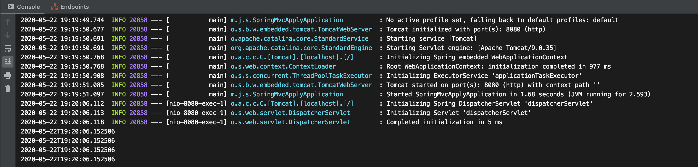

## @SessionAttribute

### @SessionAttribute

- HttpSession을 사용할 때 비해 타입 컨버전을 자동으로 지원하기 떄문에 조금 편리함
- HTTP 세션에 데이터를 넣고 빼고 싶은 경우에 HttpSession을 사용할 것

### @SessionAttributes와 차이점

- @SessionAttributes는 해당 컨트롤러 내에서만 동작

  해당 컨트롤러 안에서 다루는 특정 모델 객체를 세션에 넣고 공유할 때 사용

- @SessonAttribute는 컨트롤러 밖에서 만들어준 세션 데이터에 접근 할 때 사용한다

### @SessionAttribute 사용 예시

VisitTimeInterceptor를 HandlerInterceptor를 구현하여 만든다 preHandle을 이용해 Handler가 처리하기 전에 SessionAttribute로 "visitTime"을 넣는다

```java
public class VisitTimeInterceptor implements HandlerInterceptor {
    @Override
    public boolean preHandle(HttpServletRequest request, HttpServletResponse response, Object handler) throws Exception {
        HttpSession session = request.getSession();
        if (session.getAttribute("visitTime") == null) {
            session.setAttribute("visitTime", LocalDateTime.now());
        }
        return true;
    }
}
```

addInterceptor를 구현하여 VisitTimeInterceptor를 추가한다

```java
@Configuration
public class WebConfig implements WebMvcConfigurer {

		//...
    @Override
    public void addInterceptors(InterceptorRegistry registry) {
        registry.addInterceptor(new VisitTimeInterceptor());
    }
}
```

핸들러에 다음과 같이 key인 "visitTime"과 같은 이름의 아규먼트로 SessionAttribute의 값을 가져오는 것을 확인 할 수 있다

```java
import org.springframework.stereotype.Controller;
import org.springframework.ui.Model;
import org.springframework.validation.BindingResult;
import org.springframework.validation.annotation.Validated;
import org.springframework.web.bind.annotation.*;
import org.springframework.web.bind.support.SessionStatus;

import java.time.LocalDateTime;
import java.util.ArrayList;
import java.util.List;

@Controller
@SessionAttributes("event")
public class SampleController {
		//...
    @GetMapping("/events/list")
    public String getEvents(Model model,
                            @SessionAttribute LocalDateTime visitTime) {
        System.out.println(visitTime);
        Event event = new Event();
        event.setName("spring");
        event.setLimit(10);

        List<Event> eventList = new ArrayList<>();
        eventList.add(event);

        model.addAttribute(eventList);

        return "/events/list";
    }

}
```



