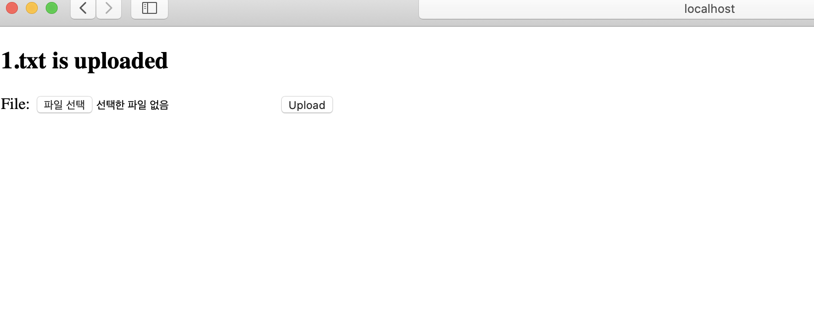

## MultipartFIle

### MultipartFile

- 파일 업로드시 사용하는 핸들러 메소드 아규먼트

- MultipartResolver 빈이 설정 되어 있어야 사용할수 있다

  (스프링 부트 자동 설정이 해줌)

- `List<MultipartFile>` 아규먼트로 여러 파일을 참조할 수 있다

MultipartResolver를 빈으로 등록하는 스프링부트 설정 코드

```java
@Configuration(proxyBeanMethods = false)
@ConditionalOnClass({ Servlet.class, StandardServletMultipartResolver.class, MultipartConfigElement.class })
@ConditionalOnProperty(prefix = "spring.servlet.multipart", name = "enabled", matchIfMissing = true)
@ConditionalOnWebApplication(type = Type.SERVLET)
@EnableConfigurationProperties(MultipartProperties.class)
public class MultipartAutoConfiguration {

	private final MultipartProperties multipartProperties;

	public MultipartAutoConfiguration(MultipartProperties multipartProperties) {
		this.multipartProperties = multipartProperties;
	}

	@Bean
	@ConditionalOnMissingBean({ MultipartConfigElement.class, CommonsMultipartResolver.class })
	public MultipartConfigElement multipartConfigElement() {
		return this.multipartProperties.createMultipartConfig();
	}

	@Bean(name = DispatcherServlet.MULTIPART_RESOLVER_BEAN_NAME)
	@ConditionalOnMissingBean(MultipartResolver.class)
	public StandardServletMultipartResolver multipartResolver() {
		StandardServletMultipartResolver multipartResolver = new StandardServletMultipartResolver();
		multipartResolver.setResolveLazily(this.multipartProperties.isResolveLazily());
		return multipartResolver;
	}

}
```

### MultipartFile 구현

/resources/templates/files 폴더 안에 index.html 파일을 만든다 요청을 "/file"로 POST 요청을 보낸다

```html
<!DOCTYPE html>
<html lang="en" xmlns:th="<http://www.thymeleaf.org>">
<head>
    <meta charset="UTF-8">
    <title>Creat New Event</title>
</head>
<body>
<div th:if="${message}">
    <h2 th:text="${message}"/>
</div>
<form action="#" th:action="@{/events}" method="post" th:object="${event}">
    <p th:if="${#fields.hasErrors('id')}" th:errors="*{id}">Incorrect data</p>
    <p th:if="${#fields.hasErrors('name')}" th:errors="*{name}">Incorrect data</p>
    <input type="text" title="id" th:field="*{id}">
    <input type="text" title="name" th:field=" *{name}">
    <input type="submit" value="Create">
</form>
</body>
</html>
```

FileController 클래스를 만든다 PostMapping 핸들러에서는 Post 요청에 있는 file을 MultipartFile에 받고 이를 FlashAttribute에 파일 이름을 넣어 index.html에 파일이 업로드 되었다고 출력하게 한다

```java
package me.jiho.springmvcapply;

import org.springframework.stereotype.Controller;
import org.springframework.ui.Model;
import org.springframework.web.bind.annotation.GetMapping;
import org.springframework.web.bind.annotation.PostMapping;
import org.springframework.web.bind.annotation.RequestParam;
import org.springframework.web.multipart.MultipartFile;
import org.springframework.web.servlet.mvc.support.RedirectAttributes;

@Controller
public class FileController {

    @GetMapping("/file")
    public String fileUploadForm(Model model) {
        return "/files/index";
    }

    @PostMapping("/file")
    public String fileUpload(@RequestParam MultipartFile file,
                             RedirectAttributes attributes) {

        //... save

        String message = file.getOriginalFilename() + " is uploaded";
        attributes.addFlashAttribute("message", message);

        return "redirect:/file";
    }
}
```



### MultipartFile Test

MockMultipartFile로 Mock 파일을 만들수 있다

```java
import org.junit.jupiter.api.Test;
import org.junit.jupiter.api.extension.ExtendWith;
import org.springframework.beans.factory.annotation.Autowired;
import org.springframework.boot.test.autoconfigure.web.servlet.AutoConfigureMockMvc;
import org.springframework.boot.test.context.SpringBootTest;
import org.springframework.mock.web.MockMultipartFile;
import org.springframework.test.context.junit.jupiter.SpringExtension;
import org.springframework.test.web.servlet.MockMvc;

import static org.junit.jupiter.api.Assertions.*;
import static org.springframework.test.web.servlet.request.MockMvcRequestBuilders.multipart;
import static org.springframework.test.web.servlet.result.MockMvcResultHandlers.print;
import static org.springframework.test.web.servlet.result.MockMvcResultMatchers.status;

@ExtendWith(SpringExtension.class)
@SpringBootTest
@AutoConfigureMockMvc
class FileControllerTest {

    @Autowired
    private MockMvc mockMvc;

    @Test
    public void fileUploadTest() throws Exception {
        //"인자로 전달될 파일 이름", "실제 파일 이름", "contentType", "content"
        MockMultipartFile file = new MockMultipartFile("file", "test.txt", "text/plain", "hello file".getBytes());
        //multipart는 post 요청에 encryptType이 formdata
        this.mockMvc.perform(multipart("/file").file(file))
                .andDo(print())
                .andExpect(status().is3xxRedirection());
    }
}
```